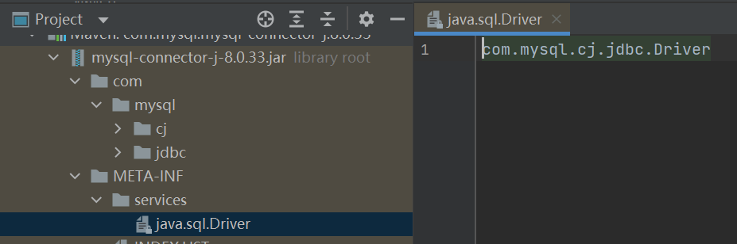
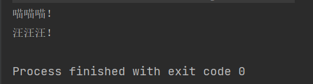
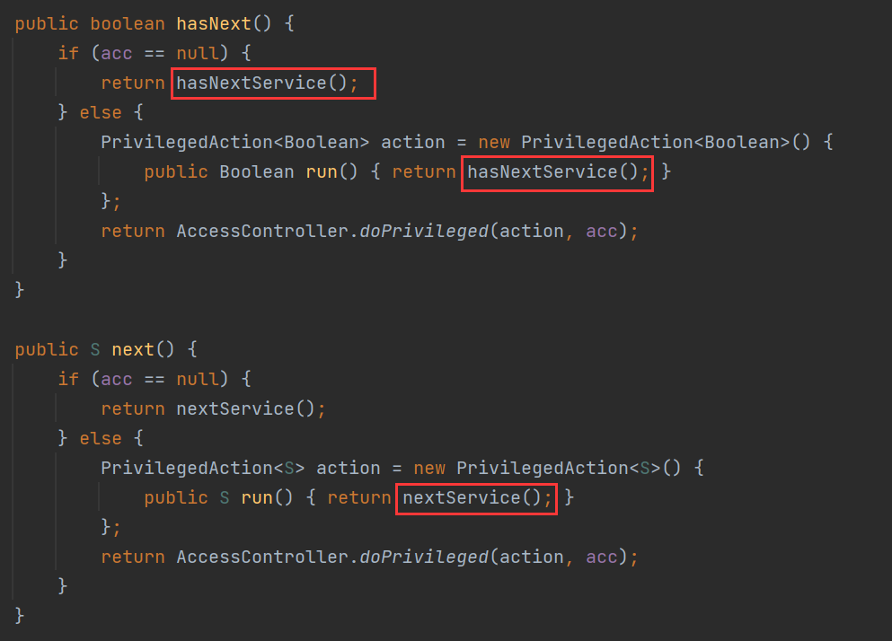
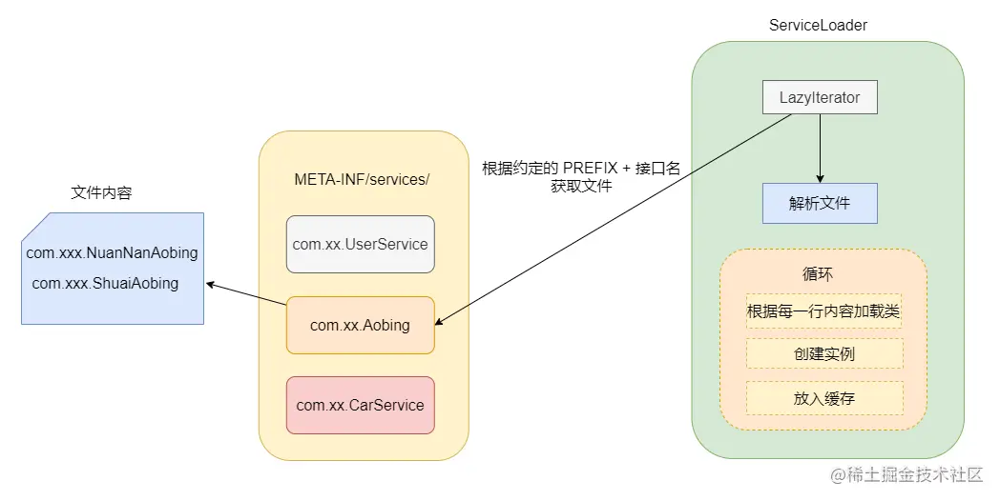
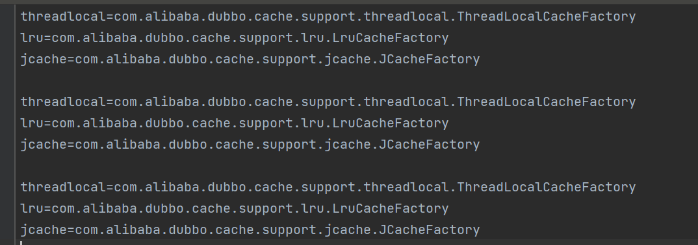

# 1. SPI 机制

Dubbo 就依靠 SPI 机制实现了插件化功能，几乎将所有的功能组件做成基于 SPI 实现，并且默认提供了很多可以直接使用的扩展点，**实现了面向功能进行拆分的对扩展开放的架构**。

## 1.1 Java SPI 

SPI (Service Provider Interface)，主要是用来在框架中使用的，最常见和莫过于我们在访问数据库时候用到的`java.sql.Driver`接口了。市面上的数据库五花八门，不同的数据库底层协议的大不相同，所以首先需要**定制一个接口**，来约束一下这些数据库，使得 Java 语言的使用者在调用数据库的时候可以方便、统一的面向接口编程。数据库厂商们需要根据接口来开发他们对应的实现。**大家都约定好将实现类的配置写在一个地方，即可确定具体的实现**。

Java SPI 就是这样做的，约定在 Classpath 下的 META-INF/services/ 目录里创建一个**以服务接口命名的文件**，然后**文件里面记录的是此 jar 包提供的具体实现类的全限定名**。这样当我们引用了某个 jar 包的时候就可以去找这个 jar 包的 META-INF/services/ 目录，再根据接口名找到文件，然后读取文件里面的内容去进行实现类的加载与实例化。

比如 MySQL:



下面看一个简单示例：

```java
public interface Animal {
    void say();
}

public class Cat implements Animal {

    @Override
    public void say() {
        System.out.println("喵喵喵！");
    }
}

public class Dog implements Animal {

    @Override
    public void say() {
        System.out.println("汪汪汪！");
    }
}

public class Test {
    public static void main(String[] args) {
        ServiceLoader<Animal> serviceLoader = ServiceLoader.load(Animal.class);
        Iterator<Animal> iterator = serviceLoader.iterator(); 
        while (iterator.hasNext()) {
            Animal animal = iterator.next();
            animal.say();
        }
    }
}
```

然后我在 META-INF/services/ 目录下建了个以接口全限定名命名的文件，内容如下：

```bash
cn.itcast.tes.Cat
cn.itcast.tes.Dog
```

运行：



## 1.2 Java SPI 源码分析

`java.util.ServiceLoader#load()`：

```java
public static <S> ServiceLoader<S> load(Class<S> service) {
    ClassLoader cl = Thread.currentThread().getContextClassLoader();  // 获取当前线程的 classLoader
    return ServiceLoader.load(service, cl);
}

public static <S> ServiceLoader<S> load(Class<S> service, ClassLoader loader) {
    return new ServiceLoader<>(service, loader);
}

private ServiceLoader(Class<S> svc, ClassLoader cl) {
    service = Objects.requireNonNull(svc, "Service interface cannot be null");
    loader = (cl == null) ? ClassLoader.getSystemClassLoader() : cl; // 没有则用 SystemClassLoader
    acc = (System.getSecurityManager() != null) ? AccessController.getContext() : null;
    reload();
}

public void reload() {
    providers.clear();
    lookupIterator = new LazyIterator(service, loader); // 创建 LazyIterator
}
```

所以现在重点看 `LazyIterator`，上面例子 `serviceLoader.iterator()` 方法，实际调用的就是 `LazyIterator`：



继续跟这两个方法：

```java
// 在约定好的地方找到接口对应的文件，然后加载文件并且解析文件里面的内容
private boolean hasNextService() {
    if (nextName != null) { // 下一个不为空
        return true;
    }
    if (configs == null) {
        try {
            String fullName = PREFIX + service.getName(); // 文件位置
            if (loader == null)
                configs = ClassLoader.getSystemResources(fullName); // 加载对应的配置文件
            else
                configs = loader.getResources(fullName);
        } catch (IOException x) {
            fail(service, "Error locating configuration files", x);
        }
    }
    // 遍历文件内容, 按行遍历
    while ((pending == null) || !pending.hasNext()) {
        if (!configs.hasMoreElements()) {
            return false;
        }
        pending = parse(service, configs.nextElement()); // 解析内容
    }
    nextName = pending.next();
    return true;
}

private S nextService() {
    if (!hasNextService())
        throw new NoSuchElementException();
    String cn = nextName;
    nextName = null;
    Class<?> c = null;
    try {
        c = Class.forName(cn, false, loader);  // 加载指定的类
    } catch (ClassNotFoundException x) {
        fail(service,
             "Provider " + cn + " not found");
    }
 	// 创建实现类对象
    S p = service.cast(c.newInstance());
    // 缓存, 全限定类名为 key
    providers.put(cn, p);
    throw new Error();          // This cannot happen
}
```

引用一张图总结一下：



## 1.3 缺点

Java SPI 在查找扩展实现类的时候遍历 SPI 的配置文件并且**将实现类全部实例化**，假设一个实现类初始化过程比较消耗资源且耗时，但是你的代码里面又用不上它，这就产生了资源的浪费。所以说 **Java SPI 无法按需加载实现类**。

## 1.4 Dubbo SPI

因此 Dubbo 就自己实现了一个 SPI，让我们想一下按需加载的话首先你得给个名字，通过名字去文件里面找到对应的实现类全限定名然后加载实例化即可。

Dubbo 就是这样设计的，配置文件里面存放的是键值对，以 `CacheFactory` 为例：



并且 **Dubbo SPI 除了可以按需加载实现类之外，增加了 IOC 和 AOP 的特性，还有个自适应扩展机制。**

我们先来看一下 Dubbo 对配置文件目录的约定，不同于 Java SPI ，Dubbo 分为了三类目录。

- META-INF/services/ 目录：该目录下的 SPI 配置文件是为了用来兼容 Java SPI 。
- META-INF/dubbo/ 目录：该目录存放用户自定义的 SPI 配置文件。
- META-INF/dubbo/internal/ 目录：该目录存放 Dubbo 内部使用的 SPI 配置文件。

## 1.5 Dubbo SPI 简单实例

用法很是简单，我就拿官网上的例子来展示一下。

首先在  META-INF/dubbo 目录下按接口全限定名建立一个文件，内容如下：

```bash
optimusPrime = org.apache.spi.OptimusPrime
bumblebee = org.apache.spi.Bumblebee
```

然后在接口上标注@SPI 注解，以表明它要用SPI机制，类似下面这个图（我就是拿 Cluster 的图举个例子，和这个示例代码定义的接口不一样）。


接着通过下面的示例代码即可加载指定的实现类。


再来看一下运行的结果。


## 1.6 Dubbo 源码分析

从上面的示例代码我们知道 **ExtensionLoader** 好像就是重点，它是类似 Java SPI 中 ServiceLoader 的存在。可以看到大致流程就是先通过接口类找到一个 ExtensionLoader，然后再通过 ExtensionLoader.getExtension(name) 得到指定名字的实现类实例。

重点是 ExtensionLoader 类，先看一些成员变量：

```java
private static final String SERVICES_DIRECTORY = "META-INF/services/";
private static final String DUBBO_DIRECTORY = "META-INF/dubbo/";
private static final String DUBBO_INTERNAL_DIRECTORY = DUBBO_DIRECTORY + "internal/";  // 目录

// extensionLoader 缓存, 以 class 为 key
private static final ConcurrentMap<Class<?>, ExtensionLoader<?>> EXTENSION_LOADERS = new ConcurrentHashMap<Class<?>, ExtensionLoader<?>>();

// 实例对象的缓存, 以 class 为 key
private static final ConcurrentMap<Class<?>, Object> EXTENSION_INSTANCES = new ConcurrentHashMap<Class<?>, Object>();

// class -> name 的映射
private final ConcurrentMap<Class<?>, String> cachedNames = new ConcurrentHashMap<Class<?>, String>();

// name -> class 的映射
private final Holder<Map<String, Class<?>>> cachedClasses = new Holder<Map<String, Class<?>>>();
```

先看 getExtensionLoader方法：


+ 一些判断校验
+ 从缓存里面找是否已经存在这个类型的 ExtensionLoader 
  + 如果没有就新建一个塞入缓存，
  + 最后返回接口类对应的 ExtensionLoader

getExtension() ：从类对应的 ExtensionLoader 中通过名字找到实例化完的实现类。


如上，也是先尝试从 cachedInstances 获取持有目标对象，若为空，则新建一个 holder，再去调用 createExtension() 创建示例，在设置到示例到 holder中

再看createExtension()方法：


先获取实现类，判断缓存是否有实例，没有就反射建个实例，然后执行 set 方法依赖注入。如果有找到包装类的话，再包一层。

目前为止的流程图：


那么问题来了 getExtensionClasses() 是怎么找的呢？injectExtension() 如何注入的呢（其实我已经说了set方法注入）？为什么需要包装类呢？

### 1.6.1 getExtensionClasses

这个方法进去也是先去缓存中找，如果缓存是空的，那么调用 `loadExtensionClasses`，我们就来看下这个方法。


而 `loadDirectory`里面就是根据类名和指定的目录，找到文件先获取所有的资源，然后一个一个去加载类，然后再通过`loadClass`去做一下缓存操作。


可以看到，loadClass 之前已经加载了类，loadClass  只是根据类上面的情况做不同的缓存。分别有 `Adaptive` 、`WrapperClass` 和普通类这三种，普通类又将`Activate`记录了一下。至此对于普通的类来说整个 SPI 过程完结了。


接下来我们分别看不是普通类的几种东西是干啥用的。

### 1.6.2 Adaptive 注解 - 自适应扩展

在实际应用场景中，一个扩展接口往往会有多种实现类，因为Dubbo是基于URL驱动，所以**在运行时，通过传入URL中的某些参数来动态控制具体实现，这便是Dubbo的扩展点自适应特性。**

在Dubbo中，@Adaptive一般用来修饰类和接口方法，在整个Dubbo框架中，只有少数几个地方使用在类级别上，如AdaptiveExtensionFactory和AdaptiveCompiler，其余都标注在方法上。

#### 修饰方法级别

当扩展点的方法被@Adaptive修饰时，在Dubbo初始化扩展点时会自动生成和编译一个动态的Adaptive类。

以Protocol接口为例：

```java
@SPI("dubbo")
public interface Protocol {

    int getDefaultPort();
 
    @Adaptive
    <T> Exporter<T> export(Invoker<T> invoker) throws RpcException;

    @Adaptive
    <T> Invoker<T> refer(Class<T> type, URL url) throws RpcException;

    void destroy();
}
```

export和refer方法都被@Adaptive修饰，Dubbo在初始化扩展点时，会生成一个Protocol$Adaptive类，里面会实现这两个方法，生成的代码如下：

```java
public class Protocol$Adaptive implements org.apache.dubbo.rpc.Protocol {
    public void destroy() {
        throw new UnsupportedOperationException("The method public abstract void org.apache.dubbo.rpc.Protocol.destroy() of interface org.apache.dubbo.rpc.Protocol is not adaptive method!");
    }
 
    public int getDefaultPort() {
        throw new UnsupportedOperationException("The method public abstract int org.apache.dubbo.rpc.Protocol.getDefaultPort() of interface org.apache.dubbo.rpc.Protocol is not adaptive method!");
 
    }
 
    public org.apache.dubbo.rpc.Exporter export(org.apache.dubbo.rpc.Invoker arg0) throws org.apache.dubbo.rpc.RpcException {
        if (arg0 == null) 
            throw new IllegalArgumentException("org.apache.dubbo.rpc.Invoker argument == null");
        
        if (arg0.getUrl() == null)
            throw new IllegalArgumentException("org.apache.dubbo.rpc.Invoker argument getUrl() == null");
        
        org.apache.dubbo.common.URL url = arg0.getUrl();
        
        String extName = (url.getProtocol() == null ? "dubbo" : url.getProtocol());
        
        if (extName == null)
            throw new IllegalStateException("Failed to get extension (org.apache.dubbo.rpc.Protocol) name from url (" + url.toString() + ") use keys([protocol])");
        org.apache.dubbo.rpc.Protocol extension = 
                (org.apache.dubbo.rpc.Protocol) ExtensionLoader.getExtensionLoader(org.apache.dubbo.rpc.Protocol.class).getExtension(extName);
        return extension.export(arg0);
    }
 
    public org.apache.dubbo.rpc.Invoker refer(java.lang.Class arg0, org.apache.dubbo.common.URL arg1) throws org.apache.dubbo.rpc.RpcException {
        if (arg1 == null) 
            throw new IllegalArgumentException("url == null");
        
        org.apache.dubbo.common.URL url = arg1;
        
        String extName = (url.getProtocol() == null ? "dubbo" : url.getProtocol());
        
        if (extName == null)
            throw new IllegalStateException("Failed to get extension (org.apache.dubbo.rpc.Protocol) name from url (" + url.toString() + ") use keys([protocol])");
        
        org.apache.dubbo.rpc.Protocol extension = 
                (org.apache.dubbo.rpc.Protocol) ExtensionLoader.getExtensionLoader(org.apache.dubbo.rpc.Protocol.class).getExtension(extName);
        return extension.refer(arg0, arg1);
    }
}
```

方法里会有一些抽象的通用逻辑，根据解析URL得到的信息，找到并调用真正的实现类，这显然是一种动态代理模式。

> + 未被 @Adaptive 修饰的方法会直接抛出异常
> + 被 @Adaptive 修饰的方法，会从 url 中获取参数，再根据参数获取对应的实例对象，再调用该对象的方法

#### 修饰类级别

以AdaptiveCompiler类为例，它作为Compiler扩展点的实现类，被@Adaptive在类级别修饰。

```java
@Adaptive
public class AdaptiveCompiler implements Compiler {
 
    private static volatile String DEFAULT_COMPILER;
 
    public static void setDefaultCompiler(String compiler) {
        DEFAULT_COMPILER = compiler;
    }
 
    @Override
    public Class<?> compile(String code, ClassLoader classLoader) {
        Compiler compiler;
        ExtensionLoader<Compiler> loader = ExtensionLoader.getExtensionLoader(Compiler.class);
        String name = DEFAULT_COMPILER; // copy reference
        if (name != null && name.length() > 0) {
            compiler = loader.getExtension(name);
        } else {
            compiler = loader.getDefaultExtension();
        }
        return compiler.compile(code, classLoader);
    }
 
}
```

在Dubbo中只有2个类上有Adaptive注解修饰，分别是 AdaptiveCompiler 和 AdaptiveExtensionFactory，表示拓展的加载逻辑由人工编码完成，即硬编码实现，举个例子，AdaptiveCompiler的comiple方法不需要在运行时根据URL中参数动态生成，直接代码中固定写死。


我们再来深入分析一波 getAdaptiveExtension 里面到底干了什么。


到这里其实已经和上文分析的 `getExtensionClasses`中loadClass 对 Adaptive 特殊缓存相呼应上了。


### 1.6.3 Adaptive 注解在方法上

注解在方法上则需要动态拼接代码，然后动态生成类，我们以 Protocol 为例子来看一下。


Protocol 没有实现类注释了 Adaptive ，但是接口上有两个方法注解了 Adaptive ，有两个方法没有。

因此它走的逻辑应该应该是 `createAdaptiveExtensionClass`，


具体在里面如何生成代码的我就不再深入了，有兴趣的自己去看吧，我就把成品解析一下，就差不多了。


我美化一下给大家看看。


可以看到会生成包，也会生成 import 语句，类名就是接口加个$Adaptive，并且实现这接口，没有标记 Adaptive 注解的方法调用的话直接抛错。

我们再来看一下标注了注解的方法，我就拿 export 举例。


就像我前面说的那样，根据请求的参数，即 URL 得到具体要调用的实现类名，然后再调用 `getExtension` 获取。

整个自适应扩展流程如下。


### 1.6.4 WrapperClass - AOP

包装类是因为一个扩展接口可能有多个扩展实现类，而**这些扩展实现类会有一个相同的或者公共的逻辑**，如果每个实现类都写一遍代码就重复了，并且比较不好维护。因此就搞了个包装类，Dubbo 里帮你自动包装，只需要某个扩展类的构造函数只有一个参数，并且是扩展接口类型，就会被判定为包装类，然后记录下来，用来包装别的实现类。


### 1.6.5 injectExtension - IOC

直接看代码，很简单，就是查找 set 方法，根据参数找到依赖对象则注入。


### 1.6.6 Activate 注解

这个注解我就简单的说下，拿 Filter 举例，Filter 有很多实现类，在某些场景下需要其中的几个实现类，而某些场景下需要另外几个，而 Activate 注解就是标记这个用的。

它有三个属性，group 表示修饰在哪个端，是 provider 还是 consumer，value 表示在 URL参数中出现才会被激活，order 表示实现类的顺序。

# 总结

先放个上述过程完整的图。


# 参考链接

[《Dubbo系列》-Dubbo SPI机制](https://juejin.cn/post/6872138926216511501?searchId=20231011144201667BEE2D0F345C730D41#heading-12)

[Dubbo扩展点注解之@Adaptive](https://hujinyang.blog.csdn.net/article/details/102762197?spm=1001.2101.3001.6650.1&utm_medium=distribute.pc_relevant.none-task-blog-2%7Edefault%7EBlogCommendFromBaidu%7ERate-1-102762197-blog-122516595.235%5Ev38%5Epc_relevant_sort_base2&depth_1-utm_source=distribute.pc_relevant.none-task-blog-2%7Edefault%7EBlogCommendFromBaidu%7ERate-1-102762197-blog-122516595.235%5Ev38%5Epc_relevant_sort_base2&utm_relevant_index=2)