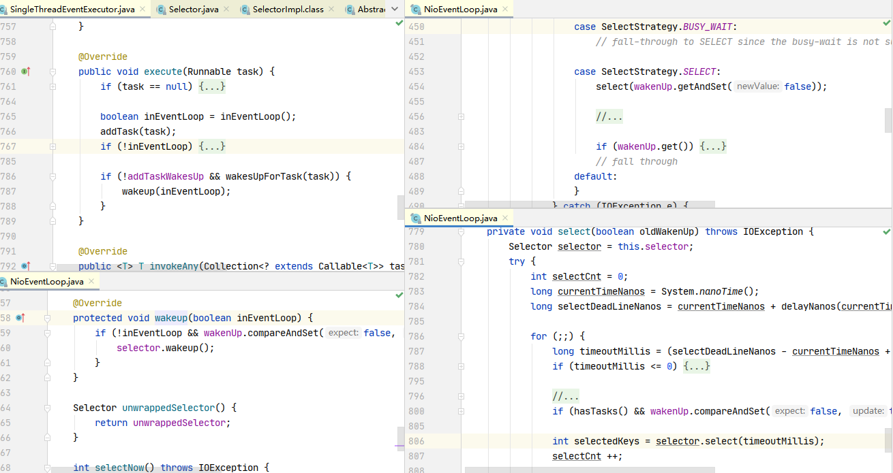

# 1 启动剖析

下面是服务端代码示例：

```java
public class HelloServer {
    public static void main(String[] args) {
         NioEventLoopGroup boss = new NioEventLoopGroup();
        NioEventLoopGroup worker = new NioEventLoopGroup();
        // 1. 启动器，负责组装 netty 组件，启动服务器
        new ServerBootstrap()
            // 2. BossEventLoop, WorkerEventLoop(selector,thread), group 组
            .group(boss, worker))
            // 3. 选择 服务器的 ServerSocketChannel 实现
            .channel(NioServerSocketChannel.class) // OIO BIO
            // 用于指定服务端启动中的逻辑
            .handler(new LoggingHandler(LogLevel.INFO))
            // 4. boss 负责处理连接 worker(child) 负责处理读写，决定了 worker(child) 能执行哪些操作（handler）
            .childHandler(
                    // 5. channel 代表和客户端进行数据读写的通道 Initializer 初始化，负责添加别的 handler
                new ChannelInitializer<NioSocketChannel>() {
                @Override
                protected void initChannel(NioSocketChannel ch) throws Exception {
                    // 6. 添加具体 handler, 这里的handler不重要, 只是为了方便读源码
                    ChannelPipeline p = ch.pipeline();
                    p.addLast(sslCtx.newHandler(ch.alloc()));
                    p.addLast(new EchoServerHandler());
                }
            })
            // 7. 绑定监听端口
            .bind(8080);
    }
}
```

整个启动过程可以分为一下几个方面：

+ `EventLoopGroup`: 不论是服务器端还是客户端, 都必须指定 `EventLoopGroup`. 在这个例子中, 指定了 `NioEventLoopGroup`, 表示一个 NIO 的`EventLoopGroup`, 不过服务器端需要指定两个 `EventLoopGroup`, 一个是 `bossGroup`, 用于处理客户端的连接请求; 另一个是 `workerGroup`, 用于处理与各个客户端连接的 IO 操作.
+ `channel()`: 指定 Channel 的类型. 因为是服务器端,，因此使用了 `NioServerSocketChannel`.
+ `handler()`：handler 字段与 accept 过程有关, 即这个 handler 负责处理客户端的连接请求
+ `childHandler()`:  boss 负责处理连接，worker(child) 负责处理读写，决定了 worker(child) 能执行哪些操作，就是负责和客户端的连接的 IO 交互
+ `bind()`：绑定监听端口

## 1.1 Channel 的初始化过程

### 1.1.1 Channel 类型确定

在服务器端, 我们调用了 `ServerBootstarap.channel(NioServerSocketChannel.class)`, 传递了一个 `NioServerSocketChannel` Class 对象。这个方法实际上是初始化了一个 `ReflectiveChannelFactory` 对象，具体如下：

```java
public B channel(Class<? extends C> channelClass) {
    // 初始化 ReflectiveChannelFactory，创建 channel 的工厂类
    return channelFactory(new ReflectiveChannelFactory<C>(
        ObjectUtil.checkNotNull(channelClass, "channelClass")
    ));
}

// ReflectiveChannelFactory的构造方法
public ReflectiveChannelFactory(Class<? extends T> clazz) {
    ObjectUtil.checkNotNull(clazz, "clazz");
    try {
        // 通过 class 对象获取到了对于的构造器
        this.constructor = clazz.getConstructor();
    } catch (NoSuchMethodException e) {
        throw new IllegalArgumentException("Class " + StringUtil.simpleClassName(clazz) +
                                           " does not have a public non-arg constructor", e);
    }
}
```

而 `ReflectiveChannelFactory` 实现了 `ChannelFactory` 接口，其提供了唯一的方法 `newChannel()`，而在 `ReflectiveChannelFactory` 进行了重写，如下：

```java
@Override
public T newChannel() {
    try {
        return constructor.newInstance();
    } catch (Throwable t) {
        throw new ChannelException("Unable to create Channel from class " + constructor.getDeclaringClass(), t);
    }
}
```

所以，根据上述源码，可以知道：

- `Bootstrap` 中的 `ChannelFactory` 的实现是 `ReflectiveChannelFactory`
- 创建 `Channel` 的具体类型是 `NioSocketChannel`
- Channel 的实例化过程:
  - 调用的 `ChannelFactory#newChannel()` 方法，实际调用的是  `ReflectiveChannelFactory#newChannel()` 。
  - 实例化的 `Channel` 的具体的类型由初始化 `Bootstrap` 时调用`channel()` 方法传入的参数确定。

### 1.1.2 channel 实例化过程

下面是 `NioServerSocketChannel` 的类层次结构图:


前面我们已经知道了如何确定一个 `Channel` 的类型, 并且了解到 `Channel` 是通过工厂方法 `ChannelFactory.newChannel()` 来实例化的, 那么 ChannelFactory.newChannel() 方法在哪里调用呢?

继续跟踪, 我们发现其调用链是:

```bash
Bootstrap.bind -> Bootstrap.dobind -> AbstractBootstrap.initAndRegister
```

在 `AbstractBootstrap.initAndRegister` 中就调用了 `channelFactory().newChannel()` 来获取一个新的 `NioSocketChannel` 实例, 其源码如下:

```java
final ChannelFuture initAndRegister() {
    // 去掉非关键代码
    final Channel channel = channelFactory().newChannel();
    init(channel);
    ChannelFuture regFuture = group().register(channel);
}
```

在 **newChannel** 中, 通过类对象的 newInstance 来获取一个新 Channel 实例, 因而会调用 NioSocketChannel 的默认构造器：

```java
public NioServerSocketChannel() {
    this(newSocket(DEFAULT_SELECTOR_PROVIDER));
}
```

**这里的代码比较关键**，在这个构造器中, 会调用 **newSocket** 来打开一个新的 **Java NIO SocketChannel**:

```java
private static ServerSocketChannel newSocket(SelectorProvider provider) {
    // ...
	return provider.openServerSocketChannel();
}
```

接着就是一级一级的父类构造器调用：AbstractNioMessageChannel -> AbstractNioChannel -> AbstractChannel

```java
// NioServerSocketChannel 构造方法, 参数 channel 是 Java nio ServerSocketChannel
public NioServerSocketChannel(ServerSocketChannel channel) {
    // parent 为 null, 
    super(null, channel, SelectionKey.OP_ACCEPT);
    // 创建 config, 并且指定 
    config = new NioServerSocketChannelConfig(this, javaChannel().socket());
}

// AbstractNioMessageChannel 构造方法, 参数依次：null, ssc, SelectionKey.OP_ACCEPT
protected AbstractNioMessageChannel(Channel parent, SelectableChannel ch, int readInterestOp) {
    super(parent, ch, readInterestOp);
}

// AbstractNioChannel 构造方法
protected AbstractNioChannel(Channel parent, SelectableChannel ch, int readInterestOp) {
    super(parent);
    this.ch = ch;
    // 接收事件
    this.readInterestOp = readInterestOp;
    // 设置为非阻塞
    ch.configureBlocking(false);
}

// AbstractChannel 构造方法
protected AbstractChannel(Channel parent) {
    this.parent = parent;
    id = newId();
    unsafe = newUnsafe();
    // 创建 pipeline
    pipeline = newChannelPipeline();
}
```

到这里, 一个完 NioSocketChannel 就初始化完成了，总结一下过程：

+ 调用 NioServerSocketChannel.newSocket(DEFAULT_SELECTOR_PROVIDER) 打开一个新的 **Java NIO ServerSocketChannel**

- AbstractChannel(Channel parent) 中初始化 AbstractChannel 的属性:
  - parent 属性置为 null
  - unsafe 通过newUnsafe() 实例化一个 unsafe 对象, 它的类型是 AbstractNioByteChannel.NioByteUnsafe 内部类
  - pipeline 是 new DefaultChannelPipeline(this) 新创建的实例. `这里体现了:Each channel has its own pipeline and it is created automatically when a new channel is created.`
- AbstractNioChannel 中的属性:
  - SelectableChannel ch 被设置为 Java SocketChannel, 即 NioSocketChannel#newSocket 返回的 Java NIO SocketChannel.
  - readInterestOp 被设置为 SelectionKey.OP_ACCEPT
  - SelectableChannel ch 被配置为非阻塞的 **ch.configureBlocking(false)**
- NioServerSocketChannel 中的属性:
  - config = new NioServerSocketChannelConfig(this, javaChannel().socket());

### 1.1.3 unsafe 字段的初始化

在实例化 NioSocketChannel 的过程中, 会在父类 AbstractChannel 的构造器中, 调用 newUnsafe() 来获取一个 unsafe 实例。其实 unsafe 特别关键, 它封装了对 Java 底层 Socket 的操作, 因此实际上是沟通 Netty 上层和 Java 底层的重要的桥梁。

```java
interface Unsafe {
    RecvByteBufAllocator.Handle recvBufAllocHandle();
    SocketAddress localAddress();
    SocketAddress remoteAddress();
    void register(EventLoop eventLoop, ChannelPromise promise);
    void bind(SocketAddress localAddress, ChannelPromise promise);
    void connect(SocketAddress remoteAddress, SocketAddress localAddress, ChannelPromise promise);
    void disconnect(ChannelPromise promise);
    void close(ChannelPromise promise);
    void closeForcibly();
    void deregister(ChannelPromise promise);
    void beginRead();
    void write(Object msg, ChannelPromise promise);
    void flush();
    ChannelPromise voidPromise();
    ChannelOutboundBuffer outboundBuffer();
}
```

这些方法其实都会对应到相关的 Java 底层的 Socket 的操作。

## 1.2 pipeline 的初始化

根据 `Each channel has its own pipeline and it is created automatically when a new channel is created.`，在实例化一个 Channel 时, 必然伴随着实例化一个 ChannelPipeline。而我们确实在 AbstractChannel 的构造器看到了 pipeline 字段被初始化为 DefaultChannelPipeline 的实例。(AbstractChannel 构造方法调用了 newChannelPipeline()方法)

```java
protected DefaultChannelPipeline newChannelPipeline() {
    return new DefaultChannelPipeline(this);
}

protected DefaultChannelPipeline(Channel channel) {
    // channel 和 pipeline 绑定
    this.channel = ObjectUtil.checkNotNull(channel, "channel");
    succeededFuture = new SucceededChannelFuture(channel, null);
    voidPromise =  new VoidChannelPromise(channel, true);
	
    tail = new TailContext(this);
    head = new HeadContext(this);

    head.next = tail;
    tail.prev = head;
}
```

其中 head 和 tail 这两个字段是一个双向链表的头和尾。其实在 DefaultChannelPipeline 中, 维护了一个以 AbstractChannelHandlerContext 为节点的双向链表, 这个链表是 Netty 实现 Pipeline 机制的关键。关于 DefaultChannelPipeline 中的双向链表以及它所起的作用, 后面专门再说明。

HeadContext 的继承层次结构如下所示：


TailContext 的继承层次结构如下所示：


head 实现了 **ChannelOutboundHandler** 和 **ChannelInboundHandler**，而 tail 只实现了 **ChannelInboundHandler**。在分析到 Netty Pipeline 时，会反复用到 inbound 和 outbound 这两个属性。

## 1.3 EventLoop 初始化


NioEventLoop 有几个重载的构造器, 不过内容都没有什么大的区别, 最终都是调用的父类MultithreadEventLoopGroup构造器:

```java
protected MultithreadEventLoopGroup(int nThreads, Executor executor, Object... args) {
    super(nThreads == 0 ? DEFAULT_EVENT_LOOP_THREADS : nThreads, executor, args);
}
```

如果我们传入的线程数 nThreads 是0, 那么 Netty 会为我们设置默认的线程数 DEFAULT_EVENT_LOOP_THREADS，这个默认线程数会在静态代码块中初始化：

```java
static {
    DEFAULT_EVENT_LOOP_THREADS = Math.max(1, SystemPropertyUtil.getInt(
        "io.netty.eventLoopThreads", NettyRuntime.availableProcessors() * 2));
}
```

Netty 会首先从系统属性中获取 "io.netty.eventLoopThreads" 的值, 如果没有设置它的话, 那么就返回默认值: 处理器核心数 * 2。

回到 MultithreadEventLoopGroup 构造器中, 这个构造器会继续调用父类 MultithreadEventExecutorGroup 的构造器:

```java
protected MultithreadEventExecutorGroup(int nThreads, ThreadFactory threadFactory, Object... args) {
    // 去掉了参数检查, 异常处理 等代码.
    if (executor == null) {
        executor = new ThreadPerTaskExecutor(newDefaultThreadFactory());
    }
    children = new EventExecutor[nThreads];
    for (int i = 0; i < nThreads; i ++) {
        children[i] = newChild(executor, args);
    }
    chooser = chooserFactory.newChooser(children);
}

public EventExecutorChooser newChooser(EventExecutor[] executors) {
    if (isPowerOfTwo(executors.length)) {
        return new PowerOfTwoEventExecutorChooser(executors);
    } else {
        return new GenericEventExecutorChooser(executors);
    }
}
```

根据代码可知， MultithreadEventExecutorGroup 中的处理逻辑:

- 创建一个大小为 nThreads 的 EventExecutor数组
- 调用 newChhild 方法初始化 children 数组.
- 根据 nThreads 的大小, 创建不同的 Chooser, 即如果 nThreads 是 2 的幂, 则使用 PowerOfTwoEventExecutorChooser, 反之使用 GenericEventExecutorChooser 创建 Chooser, 它们的功能都是一样的, 即从 children 数组中选出一个合适的 EventExecutor 实例。

根据上面的代码, 我们知道, MultithreadEventExecutorGroup 内部维护了一个 EventExecutor 数组, Netty 的 EventLoopGroup 的实现机制其实就建立在 MultithreadEventExecutorGroup 之上。每当 Netty 需要一个 EventLoop 时, 会调用 next() 方法获取一个可用的 EventLoop。

上面代码的 newChild 方法，这个是一个抽象方法, 它的任务是实例化 EventLoop 对象。我们跟踪一下它的代码, 可以发现, 这个方法在 NioEventLoopGroup 类中实现了, 其内容很简单:

```java
protected EventLoop newChild(Executor executor, Object... args) throws Exception {
    EventLoopTaskQueueFactory queueFactory = args.length == 4 ? (EventLoopTaskQueueFactory) args[3] : null;
    return new NioEventLoop(this, executor, (SelectorProvider) args[0],
                ((SelectStrategyFactory) args[1]).newSelectStrategy(), (RejectedExecutionHandler) args[2], queueFactory);
}

NioEventLoop(NioEventLoopGroup parent, Executor executor, SelectorProvider selectorProvider,
             SelectStrategy strategy, RejectedExecutionHandler rejectedExecutionHandler,
             EventLoopTaskQueueFactory queueFactory) {
    super(parent, executor, false, newTaskQueue(queueFactory), newTaskQueue(queueFactory),
          rejectedExecutionHandler);
    provider = selectorProvider;
    // selector 
    final SelectorTuple selectorTuple = openSelector();
    selector = selectorTuple.selector;
    unwrappedSelector = selectorTuple.unwrappedSelector;
    selectStrategy = strategy;
}
```

其实就是实例化一个 NioEventLoop 对象, 然后返回它。

最后总结一下整个 EventLoopGroup 的初始化过程:

- EventLoopGroup (其实是MultithreadEventExecutorGroup) 内部维护一个类型为 EventExecutor children 数组, 其大小是 nThreads, 这样就构成了一个线程池
- 如果我们在实例化 NioEventLoopGroup 时, 如果指定线程池大小, 则 nThreads 就是指定的值, 反之是处理器核心数 * 2
- MultithreadEventExecutorGroup 中会调用 newChild 抽象方法来初始化 children 数组
- 抽象方法 newChild 是在 NioEventLoopGroup 中实现的, 它返回一个 NioEventLoop 实例
- NioEventLoop 属性:
  - SelectorProvider provider 属性: NioEventLoopGroup 构造器中通过 SelectorProvider.provider() 获取一个 SelectorProvider
  - Selector selector 属性: **NioEventLoop 构造器中通过调用通过 selector = provider.openSelector() 获取一个 selector 对象。**

## 1.4 channel 的注册过程

在前面的分析中, 我们提到, channel 会在 Bootstrap.initAndRegister 中进行初始化, 但是这个方法还会将初始化好的 Channel 注册到 EventGroup 中。接下来我们就来分析一下 Channel 注册的过程。回顾一下 AbstractBootstrap.initAndRegister 方法:

`io.netty.bootstrap.AbstractBootstrap#initAndRegister`

```java
final ChannelFuture initAndRegister() {
    Channel channel = null;
    try {
        // 创建 NioServerSocketChannel
        channel = channelFactory.newChannel();
        // 1.1 初始化 - 做的事就是添加一个初始化器 ChannelInitializer
        init(channel);
    } catch (Throwable t) {
        // 处理异常...
        return new DefaultChannelPromise(new FailedChannel(), GlobalEventExecutor.INSTANCE).setFailure(t);
    }
    // 1.2 注册 - 做的事就是将原生 channel 注册到 selector 上
    ChannelFuture regFuture = config().group().register(channel);
    if (regFuture.cause() != null) {
        // 处理异常...
    }
    return regFuture;
}
```

当Channel 初始化后, 会紧接着调用 group().register() 方法来注册 Channel, 我们继续跟踪的话, 会发现其调用链如下:
AbstractBootstrap.initAndRegister -> MultithreadEventLoopGroup.register -> SingleThreadEventLoop.register -> AbstractUnsafe.register
通过跟踪调用链, 最终我们发现是调用到了 unsafe 的 register 方法, 那么接下来我们就仔细看一下 AbstractUnsafe.register 方法中到底做了什么:

```java
public final void register(EventLoop eventLoop, final ChannelPromise promise) {

    AbstractChannel.this.eventLoop = eventLoop;
    if (eventLoop.inEventLoop()) {
        register0(promise);
    } else {
        eventLoop.execute(new Runnable() {
            @Override
            public void run() {
                register0(promise);
            }
        });
    }
}

private void register0(ChannelPromise promise) {
    // 原生的 nio channel 绑定到 selector 上，注意此时没有注册 selector 关注事件，附件为 NioServerSocketChannel
    doRegister();
    // 回调 pipeline 中 handler 的 handlerAdded()方法。
    pipeline.invokeHandlerAddedIfNeeded();
    // 设置注册成功, 回调 io.netty.bootstrap.AbstractBootstrap#doBind0 方法
    safeSetSuccess(promise);
    // 触发 ChannelInitializer.initChannel 方法的调用.
    pipeline.fireChannelRegistered();
}

 protected void doRegister() throws Exception {
     boolean selected = false;
     for (;;) {
         try {
             // 
             selectionKey = javaChannel().register(eventLoop().unwrappedSelector(), 0, this);
             return;
         } catch (CancelledKeyException e) {
             if (!selected) {
                 // Force the Selector to select now as the "canceled" SelectionKey may still be
                 // cached and not removed because no Select.select(..) operation was called yet.
                 eventLoop().selectNow();
                 selected = true;
             } else {
                 // We forced a select operation on the selector before but the SelectionKey is still cached
                 // for whatever reason. JDK bug ?
                 throw e;
             }
         }
     }
 }
```

javaChannel() 这个方法前面分析过, 它返回的是一个 Java NIO SocketChannel, 在这里将 SocketChannel 注册到与 eventLoop 关联的 selector 上。

总结一下 Channel 的注册过程:

- 首先在 AbstractBootstrap.initAndRegister中, 通过 group().register(channel), 调用 MultithreadEventLoopGroup.register 方法
- 在MultithreadEventLoopGroup.register 中, 通过 next() 获取一个可用的 SingleThreadEventLoop, 然后调用它的 register
- 在 SingleThreadEventLoop.register 中, 通过 channel.unsafe().register(this, promise) 来获取 channel 的 unsafe() 底层操作对象, 然后调用它的 register
- 在 AbstractUnsafe.register 方法中, 调用 register0 方法注册 Channel
- 在 AbstractUnsafe.register0 中, 调用 AbstractNioChannel.doRegister 方法
- **AbstractNioChannel.doRegister 方法通过 javaChannel().register(eventLoop().selector, 0, this) 将 Channel 对应的 Java NIO SockerChannel 注册到一个 eventLoop 的 Selector 中, 并且将当前 Channel 作为 attachment**

## 1.5 bossGroup 与 workerGroup

boosGroup 用于 Accept 连接建立事件并分发请求， workerGroup 用于处理 I/O 读写事件和业务逻辑。

首先, 服务器端 bossGroup 不断地监听是否有客户端的连接, 当发现有一个新的客户端连接到来时, bossGroup 就会为此连接初始化各项资源, 然后从 workerGroup 中选出一个 EventLoop 绑定到此客户端连接中。那么接下来的服务器与客户端的交互过程就全部在此分配的 EventLoop 中了。


首先在ServerBootstrap 初始化时, 调用了 **b.group(bossGroup, workerGroup)** 设置了两个 EventLoopGroup, 我们跟踪进去看一下:

```java
public ServerBootstrap group(EventLoopGroup parentGroup, EventLoopGroup childGroup) {
    super.group(parentGroup);
    ...
    this.childGroup = childGroup;
    return this;
}
```

这个方法初始化了两个字段, 一个是 **group = parentGroup**, 它是在 super.group(parentGroup) 中初始化的, 另一个是 **childGroup = childGroup**. 接着我们启动程序调用了 b.bind() 方法来监听一个本地端口. bind 方法会触发如下的调用链:

```bash
AbstractBootstrap.bind -> AbstractBootstrap.doBind -> AbstractBootstrap.initAndRegister
```

回顾一下这个方法：AbstractBootstrap.initAndRegister

```java
final ChannelFuture initAndRegister() {
    final Channel channel = channelFactory().newChannel();
    ... 省略异常判断
    init(channel);
    // 这里的 group 为 bossGroup, channel 为 NioServerSocketChannsl 实例
    ChannelFuture regFuture = group().register(channel);
    return regFuture;
}
```

**group().register(channel) 将 bossGroup 中某个 eventLoop 和 NioServerSocketChannel 关联起来了。**

那么 workerGroup 是在哪里与 NioSocketChannel 关联的呢?  我们继续看 **init(channel)** 方法:

```java
@Override
void init(Channel channel) throws Exception {
    ...
    ChannelPipeline p = channel.pipeline();

    final EventLoopGroup currentChildGroup = childGroup;
    final ChannelHandler currentChildHandler = childHandler;
    final Entry<ChannelOption<?>, Object>[] currentChildOptions;
    final Entry<AttributeKey<?>, Object>[] currentChildAttrs;
	// 在 pipeline 中添加了一个 ChannelInitializer
    p.addLast(new ChannelInitializer<Channel>() {
        @Override
        public void initChannel(Channel ch) throws Exception {
            ChannelPipeline pipeline = ch.pipeline();
            ChannelHandler handler = handler();
            if (handler != null) {
                pipeline.addLast(handler);
            }
            // 
            pipeline.addLast(new ServerBootstrapAcceptor(
                    currentChildGroup, currentChildHandler, currentChildOptions, currentChildAttrs));
        }
    });
}
```

init 方法在 ServerBootstrap 中重写，它为 pipeline 中添加了一个 ChannelInitializer, 在 ChannelInitializer 中添加一个关键的**ServerBootstrapAcceptor**  现在关注一下 ServerBootstrapAcceptor 类。ServerBootstrapAcceptor 中重写了 channelRead 方法, 其主要代码如下:

```java
@Override
public void channelRead(ChannelHandlerContext ctx, Object msg) {
    final Channel child = (Channel) msg;
    child.pipeline().addLast(childHandler);
    ...
    childGroup.register(child).addListener(...);
}
```

ServerBootstrapAcceptor 中的 childGroup 是构造此对象是传入的 currentChildGroup, 即我们的 workerGroup, 而 Channel 是一个 NioSocketChannel 的实例, 因此这里的 **childGroup.register 就是将 workerGroup 中的某个 EventLoop 和 NioSocketChannel 关联了**。既然这样, 那么现在的问题是, ServerBootstrapAcceptor.channelRead 方法是怎么被调用的呢? 其实当一个 client 连接到 server 时, Java 底层的 NIO ServerSocketChannel 会有一个 **SelectionKey.OP_ACCEPT** 就绪事件, 接着就会调用到 NioServerSocketChannel.doReadMessages:

```java
@Override
protected int doReadMessages(List<Object> buf) throws Exception {
    SocketChannel ch = javaChannel().accept();
    ... 省略异常处理
    buf.add(new NioSocketChannel(this, ch));
    return 1;
}
```

在 doReadMessages 中, 通过 javaChannel().accept() 获取到客户端新连接的 SocketChannel, 接着就实例化一个 **NioSocketChannel**, 并且传入 NioServerSocketChannel 对象(即 this), 由此可知, 我们创建的这个 NioSocketChannel 的父 Channel 就是 NioServerSocketChannel 实例 。

接下来就经由 Netty 的 ChannelPipeline 机制, 将读取事件逐级发送到各个 handler 中, 于是就会触发前面我们提到的 ServerBootstrapAcceptor.channelRead 方法了。

## 1.6 handler 的添加过程

服务器端的 handler 的添加过程和客户端的有点区别, 和 EventLoopGroup 一样, 服务器端的 handler 也有两个, 一个是通过 handler() 方法设置 handler 字段, 另一个是通过 childHandler() 设置 childHandler 字。通过前面的 bossGroup 和 workerGroup 的分析, 其实我们在这里可以大胆地猜测: handler 字段与 accept 过程有关, 即这个 handler 负责处理客户端的连接请求; 而 childHandler 就是负责和客户端的连接的 IO 交互。

在 **关于 bossGroup 与 workerGroup** 小节中, 我们提到, ServerBootstrap 重写了 init 方法, 在这个方法中添加了 handler:

```java
@Override
void init(Channel channel) throws Exception {
    ...
    ChannelPipeline p = channel.pipeline();

    final EventLoopGroup currentChildGroup = childGroup;
    final ChannelHandler currentChildHandler = childHandler;
    final Entry<ChannelOption<?>, Object>[] currentChildOptions;
    final Entry<AttributeKey<?>, Object>[] currentChildAttrs;

    p.addLast(new ChannelInitializer<Channel>() {
        @Override
        public void initChannel(Channel ch) throws Exception {
            ChannelPipeline pipeline = ch.pipeline();
            // 重点
            ChannelHandler handler = handler();
            if (handler != null) {
                pipeline.addLast(handler);
            }
            pipeline.addLast(new ServerBootstrapAcceptor(
                    currentChildGroup, currentChildHandler, currentChildOptions, currentChildAttrs));
        }
    });
}
```

上面代码的 **initChannel** 方法中, 首先通过 handler() 方法获取一个 handler, 如果获取的 handler 不为空,则添加到 pipeline 中。然后接着, 添加了一个 ServerBootstrapAcceptor 实例。那么这里 handler() 方法返回的是哪个对象呢? 其实它返回的是 handler 字段, 而这个字段就是我们在服务器端的启动代码中设置的:

```java
.handler(new LoggingHandler(LogLevel.INFO))
```

那么这个时候, pipeline 中的 handler 情况如下:


根据我们原来分析客户端的经验, 我们指定, 当 channel 绑定到 eventLoop 后(在这里是 NioServerSocketChannel 绑定到 bossGroup)中时, 会在 pipeline 中发出 **fireChannelRegistered** 事件, 接着就会触发 ChannelInitializer.initChannel 方法的调用，然后将 LoggingHandler 和 ServerBootstrapAcceptor 添加到 pipeline，并移除当前 hander，即匿名的 ChannelInitializer。因此在绑定完成后, 此时的 pipeline 的内如如下:

```java
private boolean initChannel(ChannelHandlerContext ctx) throws Exception {
    if (initMap.add(ctx)) { // Guard against re-entrance.
        try {
            // 匿名 ChannelInitializer 的 initChannel() 方法
            initChannel((C) ctx.channel());
        } catch (Throwable cause) {
            // Explicitly call exceptionCaught(...) as we removed the handler before calling initChannel(...).
            // We do so to prevent multiple calls to initChannel(...).
            exceptionCaught(ctx, cause);
        } finally {
            ChannelPipeline pipeline = ctx.pipeline();
            if (pipeline.context(this) != null) {
                pipeline.remove(this); // 移除当前 hander, 即匿名的 ChannelInitializer
            }
        }
        return true;
    }
    return false;
}
```


前面我们在分析 bossGroup 和 workerGroup 时, 已经知道了在 ServerBootstrapAcceptor.channelRead 中会为新建的 Channel 设置 handler 并注册到一个 eventLoop 中, 即:

```java
@Override
public void channelRead(ChannelHandlerContext ctx, Object msg) {
    final Channel child = (Channel) msg;
    child.pipeline().addLast(childHandler);
    ...
    childGroup.register(child).addListener(...);
}
```

而这里的 childHandler 就是我们在服务器端启动代码中设置的 handler:

```java
.childHandler(new ChannelInitializer<SocketChannel>() {
    @Override
    public void initChannel(SocketChannel ch) throws Exception {
        ChannelPipeline p = ch.pipeline();
        p.addLast(sslCtx.newHandler(ch.alloc()));
        p.addLast(new EchoServerHandler());
    }
});
```


最后我们来总结一下服务器端的 handler 与 childHandler 的区别与联系:

- 在服务器 NioServerSocketChannel 的 pipeline 中添加的是 handler 与 ServerBootstrapAcceptor。
- 当有新的客户端连接请求时, ServerBootstrapAcceptor.channelRead 中负责新建此连接的 NioSocketChannel 并添加 childHandler 到 NioSocketChannel 对应的 pipeline 中, 并将此 channel 绑定到 workerGroup 中的某个 eventLoop 中。
- handler 是在 accept 阶段起作用, 它处理客户端的连接请求。
- childHandler 是在客户端连接建立以后起作用, 它负责客户端连接的 IO 交互。

下面我们用一幅图来总结一下服务器端的 handler 添加流程:


## 1.7 端口绑定

关键代码 `io.netty.bootstrap.AbstractBootstrap#doBind0`

```java
private static void doBind0(
        final ChannelFuture regFuture, final Channel channel,
        final SocketAddress localAddress, final ChannelPromise promise) {
	// nio thread 
    channel.eventLoop().execute(new Runnable() {
        @Override
        public void run() {
            if (regFuture.isSuccess()) {
                channel.bind(localAddress, promise).addListener(ChannelFutureListener.CLOSE_ON_FAILURE);
            } else {
                promise.setFailure(regFuture.cause());
            }
        }
    });
}
```

关键代码 `io.netty.channel.AbstractChannel.AbstractUnsafe#bind`

```java
public final void bind(final SocketAddress localAddress, final ChannelPromise promise) {
    assertEventLoop();

    if (!promise.setUncancellable() || !ensureOpen(promise)) {
        return;
    }

    if (Boolean.TRUE.equals(config().getOption(ChannelOption.SO_BROADCAST)) &&
        localAddress instanceof InetSocketAddress &&
        !((InetSocketAddress) localAddress).getAddress().isAnyLocalAddress() &&
        !PlatformDependent.isWindows() && !PlatformDependent.maybeSuperUser()) {
        // 记录日志...
    }

    boolean wasActive = isActive();
    try {
        // 3.3 执行端口绑定
        doBind(localAddress);
    } catch (Throwable t) {
        safeSetFailure(promise, t);
        closeIfClosed();
        return;
    }

    if (!wasActive && isActive()) {
        invokeLater(new Runnable() {
            @Override
            public void run() {
                // 3.4 触发 active 事件
                pipeline.fireChannelActive();
            }
        });
    }

    safeSetSuccess(promise);
}
```

3.3 关键代码 `io.netty.channel.socket.nio.NioServerSocketChannel#doBind`

```java
protected void doBind(SocketAddress localAddress) throws Exception {
    if (PlatformDependent.javaVersion() >= 7) {
        javaChannel().bind(localAddress, config.getBacklog());
    } else {
        javaChannel().socket().bind(localAddress, config.getBacklog());
    }
}
```

3.4 关键代码 `io.netty.channel.DefaultChannelPipeline.HeadContext#channelActive`

```java
public void channelActive(ChannelHandlerContext ctx) {
    ctx.fireChannelActive();
	// 触发 read (NioServerSocketChannel 上的 read 不是读取数据，只是为了触发 channel 的事件注册)
    readIfIsAutoRead();
}
```

关键代码 `io.netty.channel.nio.AbstractNioChannel#doBeginRead`

```java
protected void doBeginRead() throws Exception {
    // Channel.read() or ChannelHandlerContext.read() was called
    final SelectionKey selectionKey = this.selectionKey;
    if (!selectionKey.isValid()) {
        return;
    }

    readPending = true;

    final int interestOps = selectionKey.interestOps();
    // readInterestOp 取值是 16，在 NioServerSocketChannel 创建时初始化好，代表关注 accept 事件
    if ((interestOps & readInterestOp) == 0) {
        selectionKey.interestOps(interestOps | readInterestOp);
    }
}
```

## 1.8 总结

```java
//1 netty 中使用 NioEventLoopGroup （简称 nio boss 线程）来封装线程和 selector
Selector selector = Selector.open(); 

//2 创建 NioServerSocketChannel，同时会初始化它关联的 handler，以及为原生 ssc 存储 config
NioServerSocketChannel attachment = new NioServerSocketChannel();

//3 创建 NioServerSocketChannel 时，创建了 java 原生的 ServerSocketChannel
ServerSocketChannel serverSocketChannel = ServerSocketChannel.open(); 
serverSocketChannel.configureBlocking(false);

//4 启动 nio boss 线程执行接下来的操作

//5 注册（仅关联 selector 和 NioServerSocketChannel），未关注事件
SelectionKey selectionKey = serverSocketChannel.register(selector, 0, attachment);

//6 head -> 初始化器 -> ServerBootstrapAcceptor -> tail，初始化器是一次性的，只为添加 acceptor

//7 绑定端口
serverSocketChannel.bind(new InetSocketAddress(8080));

//8 触发 channel active 事件，在 head 中关注 op_accept 事件
selectionKey.interestOps(SelectionKey.OP_ACCEPT);
```


上述的 nio-thread 均为 bossGroup 中的 nioEventLoop。

```java
public boolean continueReading(UncheckedBooleanSupplier maybeMoreDataSupplier) {
    return 
           // 一般为 true
           config.isAutoRead() &&
           // respectMaybeMoreData 默认为 true
           // maybeMoreDataSupplier 的逻辑是如果预期读取字节与实际读取字节相等，返回 true
           (!respectMaybeMoreData || maybeMoreDataSupplier.get()) &&
           // 小于最大次数，maxMessagePerRead 默认 16
           totalMessages < maxMessagePerRead &&
           // 实际读到了数据
           totalBytesRead > 0;
}
```

# 2 NioEventLoop 剖析


**NioEventLoop 线程不仅要处理 IO 事件，还要处理 Task（包括普通任务和定时任务），**

提交任务代码 `io.netty.util.concurrent.SingleThreadEventExecutor#execute`

```java
public void execute(Runnable task) {
    if (task == null) {
        throw new NullPointerException("task");
    }2

    boolean inEventLoop = inEventLoop();
    // 添加任务，其中队列使用了 jctools 提供的 mpsc 无锁队列
    addTask(task);
    if (!inEventLoop) {
        // inEventLoop 如果为 false 表示由其它线程来调用 execute，即首次调用，这时需要向 eventLoop 提交首个任务，启动死循环，会执行到下面的 doStartThread
        startThread();
        if (isShutdown()) {
            // 如果已经 shutdown，做拒绝逻辑，代码略...
        }
    }

    if (!addTaskWakesUp && wakesUpForTask(task)) {
        // 如果线程由于 IO select 阻塞了，添加的任务的线程需要负责唤醒 NioEventLoop 线程
        wakeup(inEventLoop);
    }
}
```

唤醒 select 阻塞线程`io.netty.channel.nio.NioEventLoop#wakeup`

```java
@Override
protected void wakeup(boolean inEventLoop) {
    if (!inEventLoop && wakenUp.compareAndSet(false, true)) {
        selector.wakeup();
    }
}
```

启动 EventLoop 主循环 `io.netty.util.concurrent.SingleThreadEventExecutor#doStartThread`

```java
private void doStartThread() {
    assert thread == null;
    executor.execute(new Runnable() {
        @Override
        public void run() {
            // 将线程池的当前线程保存在成员变量中，以便后续使用
            thread = Thread.currentThread();
            if (interrupted) {
                thread.interrupt();
            }

            boolean success = false;
            updateLastExecutionTime();
            try {
                // 调用外部类 SingleThreadEventExecutor 的 run 方法，进入死循环，run 方法见下
                SingleThreadEventExecutor.this.run();
                success = true;
            } catch (Throwable t) {
                logger.warn("Unexpected exception from an event executor: ", t);
            } finally {
				// 清理工作，代码略...
            }
        }
    });
}
```

`io.netty.channel.nio.NioEventLoop#run` 主要任务是执行死循环，不断看有没有新任务，有没有 IO 事件

```java
// io.netty.channel#calculateStrategy
@Override
public int calculateStrategy(IntSupplier selectSupplier, boolean hasTasks) throws Exception {
    // selectSupplier.get() 即是执行 selectNow();
    return hasTasks ? selectSupplier.get() : SelectStrategy.SELECT;
}

private final IntSupplier selectNowSupplier = new IntSupplier() {
    @Override
    public int get() throws Exception {
        return selectNow();
    }
};

protected void run() {
    for (;;) {
        try {
            try {
                // calculateStrategy 的逻辑如下：
                // 有任务，会执行一次 selectNow，清除上一次的 wakeup 结果，无论有没有 IO 事件，都会跳过 switch
                // 没有任务，会匹配 SelectStrategy.SELECT，看是否应当阻塞
                switch (selectStrategy.calculateStrategy(selectNowSupplier, hasTasks())) {
                    case SelectStrategy.CONTINUE:
                        continue;

                    case SelectStrategy.BUSY_WAIT:

                    case SelectStrategy.SELECT:
                        // 因为 IO 线程和提交任务线程都有可能执行 wakeup，而 wakeup 属于比较昂贵的操作，因此使用了一个原子布尔对象 wakenUp，它取值为 true 时，表示该由当前线程唤醒
                        // 进行 select 阻塞，并设置唤醒状态为 false
                        boolean oldWakenUp = wakenUp.getAndSet(false);
                        
                        // 如果在这个位置，非 EventLoop 线程抢先将 wakenUp 置为 true，并 wakeup
                        // 下面的 select 方法不会阻塞
                        // 等 runAllTasks 处理完成后，到再循环进来这个阶段新增的任务会不会及时执行呢?
                        // 因为 oldWakenUp 为 true，因此下面的 select 方法就会阻塞，直到超时
                        // 才能执行，让 select 方法无谓阻塞
                        select(oldWakenUp);

                        if (wakenUp.get()) {
                            selector.wakeup();
                        }
                    default:
                }
            } catch (IOException e) {
                rebuildSelector0();
                handleLoopException(e);
                continue;
            }

            cancelledKeys = 0;
            needsToSelectAgain = false;
            // ioRatio 默认是 50
            final int ioRatio = this.ioRatio;
            if (ioRatio == 100) {
                try {
                    // 肯定是查询就绪的 IO 事件
                    processSelectedKeys();
                } finally {
                    // ioRatio 为 100 时，总是运行完所有非 IO 任务
                    runAllTasks();
                }
            } else {                
                final long ioStartTime = System.nanoTime();
                try {
                    processSelectedKeys();
                } finally {
                    // 记录 io 事件处理耗时
                    final long ioTime = System.nanoTime() - ioStartTime;
                    // 运行非 IO 任务，一旦超时会退出 runAllTasks
                    runAllTasks(ioTime * (100 - ioRatio) / ioRatio);
                }
            }
        } catch (Throwable t) {
            handleLoopException(t);
        }
        try {
            if (isShuttingDown()) {
                closeAll();
                if (confirmShutdown()) {
                    return;
                }
            }
        } catch (Throwable t) {
            handleLoopException(t);
        }
    }
}
```

**⚠️ 注意**

> 这里有个费解的地方就是 wakeup，它既可以由提交任务的线程来调用（比较好理解），也可以由 EventLoop 线程来调用（比较费解），这里要知道 wakeup 方法的效果：
>
> * 由非 EventLoop 线程调用，会唤醒当前在执行 select 阻塞的 EventLoop 线程
> * 由 EventLoop 自己调用，本次的 wakeup 会取消下一次的 select 操作


参考下图




`io.netty.channel.nio.NioEventLoop#select`

```java
private void select(boolean oldWakenUp) throws IOException {
    Selector selector = this.selector;
    try {
        int selectCnt = 0;
        long currentTimeNanos = System.nanoTime();
        // 计算等待时间
        // * 没有 scheduledTask，超时时间为 1s
        // * 有 scheduledTask，超时时间为 `下一个定时任务执行时间 - 当前时间`
        long selectDeadLineNanos = currentTimeNanos + delayNanos(currentTimeNanos);

        for (;;) {
            long timeoutMillis = (selectDeadLineNanos - currentTimeNanos + 500000L) / 1000000L;
            // 如果超时，退出循环
            if (timeoutMillis <= 0) {
                if (selectCnt == 0) {
                    selector.selectNow();
                    selectCnt = 1;
                }
                break;
            }

            // 如果期间又有 task 退出循环，如果没这个判断，那么任务就会等到下次 select 超时时才能被执行
            // wakenUp.compareAndSet(false, true) 是让非 NioEventLoop 不必再执行 wakeup
            if (hasTasks() && wakenUp.compareAndSet(false, true)) {
                selector.selectNow();
                selectCnt = 1;
                break;
            }

            // select 有限时阻塞
            // 注意 nio 有 bug，当 bug 出现时，select 方法即使没有事件发生，也不会阻塞住，导致不断空轮询，cpu 占用 100%
            int selectedKeys = selector.select(timeoutMillis);
            // 计数加 1
            selectCnt ++;

            // 醒来后，如果有 IO 事件、或是由非 EventLoop 线程唤醒，或者有任务，退出循环
            if (selectedKeys != 0 || oldWakenUp || wakenUp.get() || hasTasks() || hasScheduledTasks()) {
                break;
            }
            if (Thread.interrupted()) {
               	// 线程被打断，退出循环
                // 记录日志
                selectCnt = 1;
                break;
            }

            long time = System.nanoTime();
            if (time - TimeUnit.MILLISECONDS.toNanos(timeoutMillis) >= currentTimeNanos) {
                // 如果超时，计数重置为 1，下次循环就会 break
                selectCnt = 1;
            } 
            // 计数超过阈值，由 io.netty.selectorAutoRebuildThreshold 指定，默认 512
            // 这是为了解决 nio 空轮询 bug
            else if (SELECTOR_AUTO_REBUILD_THRESHOLD > 0 &&
                    selectCnt >= SELECTOR_AUTO_REBUILD_THRESHOLD) {
                // 重建 selector
                selector = selectRebuildSelector(selectCnt);
                selectCnt = 1;
                break;
            }

            currentTimeNanos = time;
        }

        if (selectCnt > MIN_PREMATURE_SELECTOR_RETURNS) {
            // 记录日志
        }
    } catch (CancelledKeyException e) {
        // 记录日志
    }
}
```

处理 keys `io.netty.channel.nio.NioEventLoop#processSelectedKeys`

```java
private void processSelectedKeys() {
    if (selectedKeys != null) {
        // 通过反射将 Selector 实现类中的就绪事件集合替换为 SelectedSelectionKeySet 
        // SelectedSelectionKeySet 底层为数组实现，可以提高遍历性能（原本为 HashSet）
        processSelectedKeysOptimized();
    } else {
        processSelectedKeysPlain(selector.selectedKeys());
    }
}
```

`io.netty.channel.nio.NioEventLoop#processSelectedKey`

```java
private void processSelectedKey(SelectionKey k, AbstractNioChannel ch) {
    final AbstractNioChannel.NioUnsafe unsafe = ch.unsafe();
    // 当 key 取消或关闭时会导致这个 key 无效
    if (!k.isValid()) {
        // 无效时处理...
        return;
    }

    try {
        int readyOps = k.readyOps();
        // 连接事件
        if ((readyOps & SelectionKey.OP_CONNECT) != 0) {
            int ops = k.interestOps();
            ops &= ~SelectionKey.OP_CONNECT;
            k.interestOps(ops);

            unsafe.finishConnect();
        }

        // 可写事件
        if ((readyOps & SelectionKey.OP_WRITE) != 0) {
            ch.unsafe().forceFlush();
        }

        // 可读或可接入事件
        if ((readyOps & (SelectionKey.OP_READ | SelectionKey.OP_ACCEPT)) != 0 || readyOps == 0) {
            // 如果是可接入 io.netty.channel.nio.AbstractNioMessageChannel.NioMessageUnsafe#read
            // 如果是可读 io.netty.channel.nio.AbstractNioByteChannel.NioByteUnsafe#read
            unsafe.read();
        }
    } catch (CancelledKeyException ignored) {
        unsafe.close(unsafe.voidPromise());
    }
}
```

# 3 ChannelPipeline 剖析

## 3.1 Channel 与 ChannelPipeline

在 Netty 中每个 Channel 都有且仅有一个 ChannelPipeline 与之对应, 它们的组成关系如下:


通过上图我们可以看到, 一个 Channel 包含了一个 ChannelPipeline, 而 ChannelPipeline 中又维护了一个由 ChannelHandlerContext 组成的双向链表。这个链表的头是 HeadContext, 链表的尾是 TailContext, 并且每个 ChannelHandlerContext 中又关联着一个 ChannelHandler。

**首先回顾一下 Channel 的初始化过程：**

下面的代码是 AbstractChannel 构造器:

```java
protected AbstractChannel(Channel parent) {
    this.parent = parent;
    unsafe = newUnsafe();
    pipeline = new DefaultChannelPipeline(this);
}
```

AbstractChannel 有一个 pipeline 字段, 在构造器中会初始化它为 DefaultChannelPipeline的实例。这里的代码就印证了一点: **每个 Channel 都有一个 ChannelPipeline**。接着我们跟踪一下 DefaultChannelPipeline 的初始化过程。首先进入到 DefaultChannelPipeline 构造器中:

```java
public DefaultChannelPipeline(AbstractChannel channel) {
    if (channel == null) {
        throw new NullPointerException("channel");
    }
    this.channel = channel;

    tail = new TailContext(this);
    head = new HeadContext(this);

    head.next = tail;
    tail.prev = head;
}
```

在 DefaultChannelPipeline 构造器中, 首先将与之关联的 Channel 保存到字段 channel 中, 然后实例化两个 ChannelHandlerContext, 一个是 HeadContext 实例 head, 另一个是 TailContext 实例 tail。接着将 head 和 tail 互相指向, 构成一个双向链表。

**特别注意到, 我们在开始的示意图中, head 和 tail 并没有包含 ChannelHandler, 这是因为 HeadContext 和 TailContext 继承于 AbstractChannelHandlerContext 的同时也实现了 ChannelHandler 接口了, 因此它们有 Context 和 Handler 的双重属性。**

## 3.2 ChannelPipeline 的初始化

### 3.2.1 ChannelPipeline 实例化过程

在实例化一个 Channel 时, 会伴随着一个 ChannelPipeline 的实例化, 并且此 Channel 会与这个 ChannelPipeline 相互关联, 这一点可以通过NioSocketChannel 的父类 AbstractChannel 的构造器予以佐证:

```java
protected AbstractChannel(Channel parent) {
    this.parent = parent;
    unsafe = newUnsafe();
    pipeline = new DefaultChannelPipeline(this);
}
```

当实例化一个 Channel(这里以 EchoClient 为例, 那么 Channel 就是 NioSocketChannel), 其 pipeline 字段就是我们新创建的 DefaultChannelPipeline 对象, 那么我们就来看一下 DefaultChannelPipeline 的构造方法:

```java
public DefaultChannelPipeline(AbstractChannel channel) {
    if (channel == null) {
        throw new NullPointerException("channel");
    }
    this.channel = channel;

    tail = new TailContext(this);
    head = new HeadContext(this);

    head.next = tail;
    tail.prev = head;
}
```

可以看到, 在 DefaultChannelPipeline 的构造方法中, 将传入的 channel 赋值给字段 this.channel, 接着又实例化了两个特殊的字段: **tail** 与 **head**。这两个字段是一个双向链表的头和尾 其实在 DefaultChannelPipeline 中, 维护了一个以 AbstractChannelHandlerContext 为节点的双向链表, 这个链表是 Netty 实现 Pipeline 机制的关键。再回顾一下 head 和 tail 的类层次结构:


从类层次结构图中可以很清楚地看到, head 实现了 **ChannelOutboundHandler** 和 **ChannelInboundHandler**，而 tail 只实现了 **ChannelInboundHandler**, 并且它们都实现了 **ChannelHandlerContext** 接口, 因此可以说 **head 和 tail 即是一个 ChannelHandler, 又是一个 ChannelHandlerContext**。接着看一下 HeadContext 和 TailContext 的构造器:

```java
HeadContext(DefaultChannelPipeline pipeline) {
    super(pipeline, null, HEAD_NAME, HeadContext.class);
    unsafe = pipeline.channel().unsafe();
    setAddComplete();
}

TailContext(DefaultChannelPipeline pipeline) {
    super(pipeline, null, TAIL_NAME, TailContext.class);
    setAddComplete();
}
```

它们调用了父类 AbstractChannelHandlerContext 的构造器, 并传入参数 pipeline、name 和 class 对象。而HeadContext 获取到了 unsafe 对象。

### 3.2.2 ChannelInitializer 的添加

我们已经分析过 Channel 的组成, 最开始的时候 ChannelPipeline 中含有两个 ChannelHandlerContext(同时也是 ChannelHandler), 但是这个 Pipeline并不能实现什么特殊的功能, 因为我们还没有给它添加自定义的 ChannelHandler。

通常来说, 我们在初始化 Bootstrap, 会添加我们自定义的 ChannelHandler, 以我们熟悉的 EchoClient 来举例：

```java
Bootstrap b = new Bootstrap();
b.group(group)
 .channel(NioSocketChannel.class)
 .option(ChannelOption.TCP_NODELAY, true)
 .handler(new ChannelInitializer<SocketChannel>() {
     @Override
     public void initChannel(SocketChannel ch) throws Exception {
         ChannelPipeline p = ch.pipeline();
         p.addLast(new EchoClientHandler());
     }
 });
```

在调用 handler 时, 传入了 ChannelInitializer 对象, 它提供了一个 initChannel 方法供我们初始化 ChannelHandler。ChannelInitializer 实现了 ChannelHandler, 它是在 Bootstrap.init 方法中添加到 ChannelPipeline 中的。其代码如下:

```java
@Override
void init(Channel channel) throws Exception {
    ChannelPipeline p = channel.pipeline();
    p.addLast(handler());
    ...
}
```

上面的代码将 handler() 返回的 ChannelHandler 添加到 Pipeline 中, 而 handler() 返回的是 handler 其实就是我们在初始化 Bootstrap 调用 handler 设置的 ChannelInitializer 实例, 因此这里就是将 ChannelInitializer 插入到了 Pipeline 的末端。此时 Pipeline 的结构如下图所示:


**明明插入的是一个 ChannelInitializer 实例, 为什么在 ChannelPipeline 中的双向链表中的元素却是一个 ChannelHandlerContext?** 

我们刚才提到, 在 Bootstrap.init 中会调用 p.addLast() 方法, 将 ChannelInitializer 插入到链表末端:

```java
@Override
public ChannelPipeline addLast(EventExecutorGroup group, final String name, ChannelHandler handler) {
    // 省略了其余代码
    synchronized (this) {
        // 检查该 handler 是否重复
        checkMultiplicity(handler);
        newCtx = newContext(group, filterName(name, handler), handler);
        addLast0(newCtx);

    }
    return this;
}
```

addLast 有很多重载的方法, 我们关注这个比较重要的方法就可以了。上面的 addLast 方法中, 首先检查这个 ChannelHandler 是否是重复, 如果不重复的话, 则为这个 Handler 创建一个对应的 DefaultChannelHandlerContext 实例, 并与之关联起来(Context 中有一个 handler 属性保存着对应的 Handler 实例)。判断此 Handler 是否重复的方法：ChannelHandlerAdapter 类实现了 ChannelHandler 接口。在这个类中，有一个 boolean 类型的字段  added，用于标记处理器是否已经被添加到了 ChannelPipeline 中。而 ChannelInitializer 继承了 ChannelHandlerAdapter 。

```java
private static void checkMultiplicity(ChannelHandler handler) {
    if (handler instanceof ChannelHandlerAdapter) { // 判断是否是 ChannelHandlerAdapter 对象
        ChannelHandlerAdapter h = (ChannelHandlerAdapter) handler;
        if (!h.isSharable() && h.added) { // 如果该 handler 没有 @Sharable, 并且已经添加过, 则抛出异常, 不能添加多次
            throw new ChannelPipelineException(
                h.getClass().getName() +
                " is not a @Sharable handler, so can't be added or removed multiple times.");
        }
        h.added = true;
    }
}
```

为了添加一个 handler 到 pipeline 中, 必须把此 handler 包装成 ChannelHandlerContext。因此在上面的代码中我们可以看到新实例化了一个 newCtx 对象, 并将 handler 作为参数传递到构造方法中。首先看它的构造器:

```java
DefaultChannelHandlerContext(
    DefaultChannelPipeline pipeline, EventExecutor executor, String name, ChannelHandler handler) {
    super(pipeline, executor, name, handler.getClass());
    this.handler = handler;
}

AbstractChannelHandlerContext(DefaultChannelPipeline pipeline, EventExecutor executor,
                                  String name, Class<? extends ChannelHandler> handlerClass) {
        this.name = ObjectUtil.checkNotNull(name, "name");
        this.pipeline = pipeline;
        this.executor = executor;
        this.executionMask = mask(handlerClass); // 用 mask 来表示 handler 的类型
        // Its ordered if its driven by the EventLoop or the given Executor is an instanceof OrderedEventExecutor.
        ordered = executor == null || executor instanceof OrderedEventExecutor;
    }
```

首先调用父类 AbstractChannelHandlerContext 的构造器，保存 pipeline 对象，然后保存 handler 对象，所以此时 context 对象中有关联的 pipeline 和 handler。当创建好 Context 后, 就将这个 Context 插入到 Pipeline 的双向链表中:

```java
private void addLast0(AbstractChannelHandlerContext newCtx) {
    AbstractChannelHandlerContext prev = tail.prev;
    newCtx.prev = prev;
    newCtx.next = tail;
    prev.next = newCtx;
    tail.prev = newCtx;
}
```

这个代码就是典型的双向链表的插入操作了。当调用了 addLast 方法后, Netty 就会将此 handler 添加到双向链表中 tail 元素之前的位置。

> ChannelInitializer  是 inBound handler

## 3.3 自定义 ChannelHandler 的添加过程

在上一小节中, 我们**已经分析了一个 ChannelInitializer 如何插入到 Pipeline 中的**, 接下来就来探讨一下 ChannelInitializer 在哪里被调用, ChannelInitializer 的作用, 以及我们自定义的 ChannelHandler 是如何插入到 Pipeline 中的。

> 自定义的 ChannelHandler  是在 ChannelInitializer 的 initChannel 方法中被添加的，上节只是分析了 ChannelInitializer  被添加到了 pipeline 中

我们已经分析过 Channel 的注册过程了, 这里我们再简单地复习一下:

- 首先在 AbstractBootstrap.initAndRegister中, 通过 group().register(channel), 调用 MultithreadEventLoopGroup.register 方法
- 在MultithreadEventLoopGroup.register 中, 通过 next() 获取一个可用的 SingleThreadEventLoop, 然后调用它的 register
- 在 SingleThreadEventLoop.register 中, 通过 channel.unsafe().register(this, promise) 来获取 channel 的 unsafe() 底层操作对象, 然后调用它的 register
- 在 AbstractUnsafe.register 方法中, 调用 register0 方法注册 Channel
- 在 AbstractUnsafe.register0 中, 调用 AbstractNioChannel#doRegister 方法
- AbstractNioChannel.doRegister 方法通过 javaChannel().register(eventLoop().selector, 0, this) 将 Channel 对应的 Java NIO SockerChannel 注册到一个 eventLoop 的 Selector 中, 并且将当前 Channel 作为 attachment.

**而我们自定义 ChannelHandler 的添加过程, 发生在 AbstractUnsafe.register0 中, 在这个方法中调用了 pipeline.fireChannelRegistered() 方法**, 其实现如下:

```java
@Override
public final ChannelPipeline fireChannelRegistered() {
    AbstractChannelHandlerContext.invokeChannelRegistered(head);
    return this;
}
```

上面的代码很简单  AbstractChannelHandlerContext.invokeChannelRegistered(head) 方法而已：

```java
static void invokeChannelRegistered(final AbstractChannelHandlerContext next) {
    EventExecutor executor = next.executor();
    if (executor.inEventLoop()) {
        next.invokeChannelRegistered(); // head.invokeChannelRegistered()
    } else {
        executor.execute(new Runnable() {
            @Override
            public void run() {
                next.invokeChannelRegistered();
            }
        });
    }
}
```

由上述可知，相当于是调用了 head.invokeChannelRegistered() 方法。head 是一个 AbstractChannelHandlerContext 实例, 并且它没有重写 invokeChannelRegistered方法, 因此 head.invokeChannelRegistered其实是调用的 AbstractChannelHandlerContext.invokeChannelRegistered:

```java
private void invokeChannelRegistered() {
    // 检测 ChannelHandler 的 handlerAdded(ChannelHandlerContext) 方法是否已经被调用
    if (invokeHandler()) {
        try {
            ((ChannelInboundHandler) handler()).channelRegistered(this);
        } catch (Throwable t) {
            notifyHandlerException(t);
        }
    } else {
        fireChannelRegistered();
    }
}
```

重点是 fireChannelRegistered() 方法：

```java
@Override
public ChannelHandlerContext fireChannelRegistered() {
    invokeChannelRegistered(findContextInbound(MASK_CHANNEL_REGISTERED));
    return this;
}

// 从 head 开始查找 inBound handler
private AbstractChannelHandlerContext findContextInbound(int mask) {
    AbstractChannelHandlerContext ctx = this;
    do {
        ctx = ctx.next;
    } while ((ctx.executionMask & mask) == 0);
    return ctx;
}
```

这里判断 handler 是 inBound 和 outBound 的方法可以参考 [ChannelHandlerMask学习](https://www.cnblogs.com/keephy/articles/16952382.html)。大概就是netty的作者把inbound、outbound和exception每一个行为都用一位"1"表示了，总共17个1。ChannelHandlerMask 利用计算机中的位运算，通过或、与、非操作，进行0和1的变换从而进行筛选。利用好计算机的操作或、与、非可以极大的提高效率。

ChannelInitializer 实现了 ChannelInboudHandler, ,因此这里返回就是 ChannelInitializer 实例所对应的 ChannelHandlerContext。即:


当获取到 inbound 的 Context 后, 就调用它的 invokeChannelRegistered 方法:

```java
private void invokeChannelRegistered() {
    try {
        ((ChannelInboundHandler) handler()).channelRegistered(this);
    } catch (Throwable t) {
        notifyHandlerException(t);
    }
}
```

我们已经强调过了, 每个 ChannelHandler 都与一个 ChannelHandlerContext 关联, 可以通过 ChannelHandlerContext 获取到对应的 ChannelHandler。很显然, 这里 handler() 返回的就是一开始我们实例化的 ChannelInitializer 对象, 并接着调用了 ChannelInitializer.channelRegistered 方法：

```java
public final void channelRegistered(ChannelHandlerContext ctx) throws Exception {
    // Normally this method will never be called as handlerAdded(...) should call initChannel(...) and remove
    // the handler.
    if (initChannel(ctx)) {
        // we called initChannel(...) so we need to call now pipeline.fireChannelRegistered() to ensure we not
        // miss an event.
        ctx.pipeline().fireChannelRegistered();

        // We are done with init the Channel, removing all the state for the Channel now.
        removeState(ctx);
    } else {
        // Called initChannel(...) before which is the expected behavior, so just forward the event.
        ctx.fireChannelRegistered();
    }
}

 @SuppressWarnings("unchecked")
private boolean initChannel(ChannelHandlerContext ctx) throws Exception {
    if (initMap.add(ctx)) { // Guard against re-entrance.
        try {
            // 这里的 initChannel 为初始化化 Bootstrap 时, 调用 handler 方法传入的匿名内部类所实现的方法:
            initChannel((C) ctx.channel());
        } catch (Throwable cause) {
            exceptionCaught(ctx, cause);
        } finally {
            ChannelPipeline pipeline = ctx.pipeline();
            if (pipeline.context(this) != null) { // 移除当前 handler, 即为匿名的 ChannelInitializer 
                pipeline.remove(this);
            }
        }
        return true;
    }
    return false;
}
```

initChannel 这个方法就是我们在初始化 Bootstrap 时, 调用 handler 方法传入的匿名内部类所实现的方法:

```java
.handler(new ChannelInitializer<SocketChannel>() {
    @Override
    public void initChannel(SocketChannel ch) throws Exception {
        ChannelPipeline p = ch.pipeline();
        p.addLast(new EchoClientHandler());
    }
});
```

因此当调用了这个方法后, 我们自定义的 ChannelHandler 就插入到 Pipeline 了, 此时的 Pipeline 如下图所示:


当添加了自定义的 ChannelHandler 后, 会删除 ChannelInitializer 这个 ChannelHandler, 即 ctx.pipeline().remove(this), 因此最后的 Pipeline 如下:


## 3.4 ChannelHandler 的名字

pipeline.addXXX 都有一个重载的方法, 例如 addLast, 它有一个重载的版本是:

```java
ChannelPipeline addLast(String name, ChannelHandler handler);
```

第一个参数指定了所添加的 handler 的名字(更准确地说是 ChannelHandlerContext 的名字, 不过我们通常是以 handler 作为叙述的对象, 因此说成 handler 的名字便于理解). 那么 handler 的名字有什么用呢? 如果我们不设置name, 那么 handler 会有怎样的名字?

```java
@Override
public ChannelPipeline addLast(String name, ChannelHandler handler) {
    return addLast(null, name, handler);
}
```

这个方法会调用重载的 addLast 方法:

```java
@Override
public ChannelPipeline addLast(EventExecutorGroup group, final String name, ChannelHandler handler) {
    synchronized (this) {
        checkMultiplicity(handler);
			
        newCtx = newContext(group, filterName(name, handler), handler);

        addLast0(newCtx);
    }
    return this;
}

private String filterName(String name, ChannelHandler handler) {
    if (name == null) {
        // name 为空则生成一个
        return generateName(handler);
    }
    // 检查名字是否重复
    checkDuplicateName(name);
    return name;
}
```

看代码可知, 在添加一个 handler 之前, 需要调用 **checkDuplicateName** 方法来确定此 handler 的名字是否和已添加的 handler 的名字重复：

```java
private void checkDuplicateName(String name) {
    if (context0(name) != null) {
        throw new IllegalArgumentException("Duplicate handler name: " + name);
    }
}

private AbstractChannelHandlerContext context0(String name) {
    AbstractChannelHandlerContext context = head.next;
    while (context != tail) {
        if (context.name().equals(name)) {
            return context;
        }
        context = context.next;
    }
    return null;
}
```

检查方式为从 head 向后遍历，依次比较 handler 的 name，重复则会抛出异常。如果 name 为空，则 generateName 会接着调用 **generateName0** 来实际产生一个 handler 的名字:

```java
private static String generateName0(Class<?> handlerType) {
    return StringUtil.simpleClassName(handlerType) + "#0";
}
```

自动生成的名字的规则很简单, 就是 handler 的简单类名加上 "#0"。

## 3.5  Pipeline 的事件传输机制

**Netty 的事件可以分为 Inbound 和 Outbound 事件.**如下是从 Netty 官网上拷贝的一个图示:

```bash
                                             I/O Request
                                        via Channel or
                                    ChannelHandlerContext
                                                  |
+---------------------------------------------------+---------------+
|                           ChannelPipeline         |               |
|                                                  \|/              |
|    +---------------------+            +-----------+----------+    |
|    | Inbound Handler  N  |            | Outbound Handler  1  |    |
|    +----------+----------+            +-----------+----------+    |
|              /|\                                  |               |
|               |                                  \|/              |
|    +----------+----------+            +-----------+----------+    |
|    | Inbound Handler N-1 |            | Outbound Handler  2  |    |
|    +----------+----------+            +-----------+----------+    |
|              /|\                                  .               |
|               .                                   .               |
| ChannelHandlerContext.fireIN_EVT() ChannelHandlerContext.OUT_EVT()|
|        [ method call]                       [method call]         |
|               .                                   .               |
|               .                                  \|/              |
|    +----------+----------+            +-----------+----------+    |
|    | Inbound Handler  2  |            | Outbound Handler M-1 |    |
|    +----------+----------+            +-----------+----------+    |
|              /|\                                  |               |
|               |                                  \|/              |
|    +----------+----------+            +-----------+----------+    |
|    | Inbound Handler  1  |            | Outbound Handler  M  |    |
|    +----------+----------+            +-----------+----------+    |
|              /|\                                  |               |
+---------------+-----------------------------------+---------------+
              |                                  \|/
+---------------+-----------------------------------+---------------+
|               |                                   |               |
|       [ Socket.read() ]                    [ Socket.write() ]     |
|                                                                   |
|  Netty Internal I/O Threads (Transport Implementation)            |
+-------------------------------------------------------------------+
```

从上图可以看出, inbound 事件和 outbound 事件的流向是不一样的, inbound 事件的流行是从下至上, 而 outbound 刚好相反, 是从上到下。

+  inbound 的传递方式是通过调用相应的 **ChannelHandlerContext.fireIN_EVT()** 方法
+  outbound 方法的的传递方式是通过调用 **ChannelHandlerContext.OUT_EVT()** 方法

例如 **ChannelHandlerContext.fireChannelRegistered()** 调用会发送一个 **ChannelRegistered** 的 inbound 给下一个ChannelHandlerContext, 而 **ChannelHandlerContext.bind** 调用会发送一个 **bind** 的 outbound 事件给 下一个 ChannelHandlerContext。

Inbound 事件传播方法有:

```java
ChannelHandlerContext.fireChannelRegistered()
ChannelHandlerContext.fireChannelActive()
ChannelHandlerContext.fireChannelRead(Object)
ChannelHandlerContext.fireChannelReadComplete()
ChannelHandlerContext.fireExceptionCaught(Throwable)
ChannelHandlerContext.fireUserEventTriggered(Object)
ChannelHandlerContext.fireChannelWritabilityChanged()
ChannelHandlerContext.fireChannelInactive()
ChannelHandlerContext.fireChannelUnregistered()
```

Oubound 事件传输方法有:

```java
ChannelHandlerContext.bind(SocketAddress, ChannelPromise)
ChannelHandlerContext.connect(SocketAddress, SocketAddress, ChannelPromise)
ChannelHandlerContext.write(Object, ChannelPromise)
ChannelHandlerContext.flush()
ChannelHandlerContext.read()
ChannelHandlerContext.disconnect(ChannelPromise)
ChannelHandlerContext.close(ChannelPromise)
```

**注意, 如果我们捕获了一个事件, 并且想让这个事件继续传递下去, 那么需要调用 Context 相应的传播方法。**

例如：

```java
public class MyInboundHandler extends ChannelInboundHandlerAdapter {
    @Override
    public void channelActive(ChannelHandlerContext ctx) {
        System.out.println("Connected!");
        ctx.fireChannelActive();
    }
}

public clas MyOutboundHandler extends ChannelOutboundHandlerAdapter {
    @Override
    public void close(ChannelHandlerContext ctx, ChannelPromise promise) {
        System.out.println("Closing ..");
        ctx.close(promise);
    }
}
```

上面的例子中, MyInboundHandler 收到了一个 channelActive 事件, 它在处理后, 若希望将事件继续传播下去, 则需要接着调用 ctx.fireChannelActive()。

## 3.6 Outbound 操作

`Outbound 事件都是请求事件(request event)`, 即请求某件事情的发生, 然后通过 Outbound 事件进行通知。

**Outbound 事件的传播方向是 tail -> customContext -> head。**

我们接下来以 connect 事件为例, 分析一下 Outbound 事件的传播机制.
首先, 当用户调用了 Bootstrap.connect 方法时, 就会触发一个 **Connect 请求事件**, 此调用会触发如下调用链:

```java
Bootstrap.connect -> Bootstrap.doResolveAndConnect  -> doResolveAndConnect0 -> Bootstrap.doConnect -> AbstractChannel.connect
```

继续跟踪的话, 我们就发现, AbstractChannel.connect 其实由调用了 DefaultChannelPipeline.connect 方法:

```java
@Override
public ChannelFuture connect(SocketAddress remoteAddress, SocketAddress localAddress, ChannelPromise promise) {
    return pipeline.connect(remoteAddress, localAddress, promise);
}
```

而 pipeline.connect 的实现如下:

```java
@Override
public final ChannelFuture connect(SocketAddress remoteAddress, SocketAddress localAddress, ChannelPromise promise) {
    return tail.connect(remoteAddress, localAddress, promise);
}
```

可以看到, **当 outbound 事件(这里是 connect 事件)传递到 Pipeline 后, 它其实是以 tail 为起点开始传播的。**
而 tail.connect 其实调用的是 AbstractChannelHandlerContext.connect 方法:

```java
@Override
public ChannelFuture connect(
        final SocketAddress remoteAddress, final SocketAddress localAddress, final ChannelPromise promise) {
    // ...
    final AbstractChannelHandlerContext next = findContextOutbound(MASK_CONNECT);
    EventExecutor executor = next.executor();
    // ...
    next.invokeConnect(remoteAddress, localAddress, promise);
    // ...
    return promise;
}
```

findContextOutbound(MASK_CONNECT) 顾名思义, 它的作用是以当前 Context 为起点, 向 Pipeline 中的 Context 双向链表的前端寻找第一个 **outbound** 类型的 Context(即关联着 ChannelOutboundHandler 的 Context), 然后返回。

它的实现如下:

```java
private AbstractChannelHandlerContext findContextOutbound(int mask) {
    AbstractChannelHandlerContext ctx = this;
    do {
        ctx = ctx.prev;
    } while ((ctx.executionMask & mask) == 0);
    return ctx;
}
```

当我们找到了一个 outbound 的 Context 后, 就调用它的 invokeConnect 方法, 这个方法中会调用 Context 所关联着的 ChannelHandler 的 connect 方法:

```java
   private void invokeConnect(SocketAddress remoteAddress, SocketAddress localAddress, ChannelPromise promise) {
        if (invokeHandler()) {
            try {
                ((ChannelOutboundHandler) handler()).connect(this, remoteAddress, localAddress, promise);
            } catch (Throwable t) {
                notifyOutboundHandlerException(t, promise);
            }
        } else {
            connect(remoteAddress, localAddress, promise);
        }
    }
```

如果用户没有重写 ChannelHandler 的 connect 方法, 那么会调用 ChannelOutboundHandlerAdapter 所实现的方法:

```java
@Override
public void connect(ChannelHandlerContext ctx, SocketAddress remoteAddress,
    		SocketAddress localAddress, ChannelPromise promise) throws Exception {
    ctx.connect(remoteAddress, localAddress, promise);
}
```

我们看到, ChannelOutboundHandlerAdapter.connect 仅仅调用了 ctx.connect, 而这个调用又回到了:

```java
Context.connect -> Connect.findContextOutbound -> next.invokeConnect -> handler.connect -> Context.connect
```

这样的循环中, 直到 connect 事件传递到DefaultChannelPipeline 的双向链表的头节点, 即 head 中。为什么会传递到 head 中呢? 回想一下, head 实现了 ChannelOutboundHandler。

**因为 head 本身既是一个 ChannelHandlerContext, 又实现了 ChannelOutboundHandler 接口**, 因此当 connect 消息传递到 head 后, 会将消息转递到对应的 ChannelHandler 中处理, 而恰好, head 的 handler() 返回的就是 head 本身:

```kotlin
@Override
public ChannelHandler handler() {
    return this;
}
```

因此最终 connect 事件是在 head 中处理的。head 的 connect 事件处理方法如下:

```java
 @Override
public void connect(
    ChannelHandlerContext ctx,
    SocketAddress remoteAddress, SocketAddress localAddress,
    ChannelPromise promise) {
    unsafe.connect(remoteAddress, localAddress, promise);
}
```

到这里, 整个 Connect 请求事件就结束了。下面以一幅图来描述一个整个 Connect 请求事件的处理过程:


## 3.7 Inbound 操作

Inbound 事件和 Outbound 事件的处理过程有点镜像。Inbound 事件是一个通知事件, 即某件事已经发生了, 然后通过 Inbound 事件进行通知。Inbound 通常发生在 Channel 的状态的改变或 IO 事件就绪。

**Inbound 的特点是它传播方向是 head -> customContext -> tail**。

既然上面我们分析了 Connect 这个 Outbound 事件, 那么接着分析 Connect 事件后会发生什么 Inbound 事件, 并最终找到 Outbound 和 Inbound 事件之间的联系。当 Connect 这个 Outbound 传播到 unsafe 后, 其实是在 AbstractNioUnsafe.connect 方法中进行处理的:

```java
@Override
public final void connect(
        final SocketAddress remoteAddress, final SocketAddress localAddress, final ChannelPromise promise) {
    ...
    if (doConnect(remoteAddress, localAddress)) {
        fulfillConnectPromise(promise, wasActive);
    } else {
        ...
    }
    ...
}
```

在 AbstractNioUnsafe.connect 中, 首先调用 doConnect 方法进行实际上的 Socket 连接, 当连接上后, 会调用 fulfillConnectPromise 方法:

```java
private void fulfillConnectPromise(ChannelPromise promise, boolean wasActive) {
    ...
    // Regardless if the connection attempt was cancelled, channelActive() event should be triggered,
    // because what happened is what happened.
    if (!wasActive && isActive()) {
        pipeline().fireChannelActive();
    }
    ...
}
```

我们看到, 在 fulfillConnectPromise 中, 会通过调用 pipeline().fireChannelActive() 将通道激活的消息(即 Socket 连接成功)发送出去。**而这里, 当调用 pipeline.fireXXX 后, 就是 Inbound 事件的起点。**因此当调用了 pipeline().fireChannelActive() 后, 就产生了一个 ChannelActive Inbound 事件。

```kotlin
@Override
public final ChannelPipeline fireChannelActive() {
    // 相当于调用了 head.invokeChannelActive()方法
    AbstractChannelHandlerContext.invokeChannelActive(head);
    return this;
}

// AbstractChannelHandlerContext
static void invokeChannelActive(final AbstractChannelHandlerContext next) {
    EventExecutor executor = next.executor();
    if (executor.inEventLoop()) {
        next.invokeChannelActive(); // head.invokeChannelActive()
    } else {
        executor.execute(new Runnable() {
            @Override
            public void run() {
                next.invokeChannelActive();
            }
        });
    }
}
```

哈哈, 果然, 在 fireChannelActive 方法中, 调用的是 head.invokeChannelActive(), **因此可以证明了, Inbound 事件在 Pipeline 中传输的起点是 head**。
那么, 在 head.invokeChannelActive() 中又做了什么呢?

```java
private void invokeChannelActive() {
    if (invokeHandler()) {
        try {
            // 这里 head 重写了channelActive 方法
            ((ChannelInboundHandler) handler()).channelActive(this);
        } catch (Throwable t) {
            notifyHandlerException(t);
        }
    } else {
        fireChannelActive();
    }
}

// HeadContext
@Override
public void channelActive(ChannelHandlerContext ctx) {
    ctx.fireChannelActive();
    readIfIsAutoRead();
}

// AbstractChannelHandlerContext
@Override
public ChannelHandlerContext fireChannelActive() {
    invokeChannelActive(findContextInbound(MASK_CHANNEL_ACTIVE));
    return this;
}
```

上面的代码应该很熟悉了吧. 回想一下在 Outbound 事件(例如 Connect 事件)的传输过程中时, 我们也有类似的操作:

- 首先调用 findContextInbound, 从 Pipeline 的双向链表中中找到第一个属性 inbound 为真的 Context, 然后返回
- 调用这个 Context 的 invokeChannelActive

invokeChannelActive 方法如下:

```java
static void invokeChannelActive(final AbstractChannelHandlerContext next) {
    EventExecutor executor = next.executor();
    if (executor.inEventLoop()) {
        next.invokeChannelActive();
    } else {
        executor.execute(new Runnable() {
            @Override
            public void run() {
                next.invokeChannelActive();
            }
        });
    }
}

private void invokeChannelActive() {
    if (invokeHandler()) {
        try {
            ((ChannelInboundHandler) handler()).channelActive(this);
        } catch (Throwable t) {
            notifyHandlerException(t);
        }
    } else {
        fireChannelActive();
    }
}
```

这个方法和 Outbound 的对应方法(例如 invokeConnect) 如出一辙。同 Outbound 一样, 如果用户没有重写 channelActive 方法, 那么会调用 ChannelInboundHandlerAdapter 的 channelActive 方法:

```java
@Override
public void channelActive(ChannelHandlerContext ctx) throws Exception {
    ctx.fireChannelActive();
}
```

同样地, 在 ChannelInboundHandlerAdapter.channelActive 中, 仅仅调用了 ctx.fireChannelActive 方法, 因此就会有如下循环:

```java
Context.fireChannelActive -> Connect.findContextInbound -> nextContext.invokeChannelActive -> nextHandler.channelActive -> nextContext.fireChannelActive
```

这样的循环中，同理, tail 本身 既实现了 **ChannelInboundHandler** 接口, 又实现了 **ChannelHandlerContext** 接口, 因此当 channelActive 消息传递到 tail 后, 会将消息转递到对应的 ChannelHandler 中处理, 而恰好, tail 的 handler() 返回的就是 tail 本身:

```java
@Override
public ChannelHandler handler() {
    return this;
}
```

因此 channelActive Inbound 事件最终是在 tail 中处理的, 我们看一下它的处理方法:

```java
 @Override
public void channelActive(ChannelHandlerContext ctx) {
    onUnhandledInboundChannelActive();
}

protected void onUnhandledInboundChannelActive() {
}
```

TailContext.channelActive 方法是空的，如果读者自行查看 TailContext 的 Inbound 处理方法时, 会发现, 它们的实现都是空的. 可见, 如果是 Inbound, 当用户没有实现自定义的处理器时, 那么默认是不处理的.

用一幅图来总结一下 Inbound 的传输过程:


## 3.8  Outbound 和  Inbound 总结

对于 Outbound事件:

- Outbound 事件是请求事件(由 Connect 发起一个请求, 并最终由 unsafe 处理这个请求)
- Outbound 事件的发起者是 Channel
- Outbound 事件的处理者是 unsafe
- Outbound 事件在 Pipeline 中的传输方向是 tail -> head
- 在 ChannelHandler 中处理事件时, 如果这个 Handler 不是最后一个 Handler , 则需要调用 ctx.xxx (例如 ctx.connect) 将此事件继续传播下去。如果不这样做, 那么此事件的传播会提前终止。
- Outbound 事件流: Context.OUT_EVT -> Connect.findContextOutbound -> nextContext.invokeOUT_EVT -> nextHandler.OUT_EVT -> nextContext.OUT_EVT

对于 Inbound 事件:

- Inbound 事件是通知事件, 当某件事情已经就绪后, 通知上层。
- Inbound 事件发起者是 unsafe
- Inbound 事件的处理者是 Channel, 如果用户没有实现自定义的处理方法, 那么Inbound 事件默认的处理者是 TailContext, 并且其处理方法是空实现
- Inbound 事件在 Pipeline 中传输方向是 head -> tail
- 在 ChannelHandler 中处理事件时, 如果这个 Handler 不是最后一个 Hnalder, 则需要调用 ctx.fireIN_EVT (例如 ctx.fireChannelActive) 将此事件继续传播下去. 如果不这样做, 那么此事件的传播会提前终止
- Outbound 事件流: Context.fireIN_EVT -> Connect.findContextInbound -> nextContext.invokeIN_EVT -> nextHandler.IN_EVT -> nextContext.fireIN_EVT

outbound 和 inbound 事件十分的镜像, 并且 Context 与 Handler 直接的调用关系是否容易混淆, 需要特别的注意。

# 4 accept 剖析


nio 中如下代码，在 netty 中的流程

```java
//1 阻塞直到事件发生
selector.select();

Iterator<SelectionKey> iter = selector.selectedKeys().iterator();
while (iter.hasNext()) {    
    //2 拿到一个事件
    SelectionKey key = iter.next();
    
    //3 如果是 accept 事件
    if (key.isAcceptable()) {
        
        //4 执行 accept
        SocketChannel channel = serverSocketChannel.accept();
        channel.configureBlocking(false);
        
        //5 关注 read 事件
        channel.register(selector, SelectionKey.OP_READ);
    }
    // ...
}
```

先来看可接入事件处理（accept）

`io.netty.channel.nio.AbstractNioMessageChannel.NioMessageUnsafe#read`

```java
public void read() {
    assert eventLoop().inEventLoop();
    final ChannelConfig config = config();
    final ChannelPipeline pipeline = pipeline();    
    final RecvByteBufAllocator.Handle allocHandle = unsafe().recvBufAllocHandle();
    allocHandle.reset(config);

    boolean closed = false;
    Throwable exception = null;
    try {
        try {
            do {
				// doReadMessages 中执行了 accept 并创建 NioSocketChannel 作为消息放入 readBuf
                // readBuf 是一个 ArrayList 用来缓存消息
                int localRead = doReadMessages(readBuf);
                if (localRead == 0) {
                    break;
                }
                if (localRead < 0) {
                    closed = true;
                    break;
                }
				// localRead 为 1，就一条消息，即接收一个客户端连接
                allocHandle.incMessagesRead(localRead);
            } while (allocHandle.continueReading());
        } catch (Throwable t) {
            exception = t;
        }

        int size = readBuf.size();
        for (int i = 0; i < size; i++) {
            readPending = false;
            // 触发 read 事件，让 pipeline 上的 handler 处理，这时是处理
            // io.netty.bootstrap.ServerBootstrap.ServerBootstrapAcceptor#channelRead
            pipeline.fireChannelRead(readBuf.get(i));
        }
        readBuf.clear();
        allocHandle.readComplete();
        pipeline.fireChannelReadComplete();

        if (exception != null) {
            closed = closeOnReadError(exception);

            pipeline.fireExceptionCaught(exception);
        }

        if (closed) {
            inputShutdown = true;
            if (isOpen()) {
                close(voidPromise());
            }
        }
    } finally {
        if (!readPending && !config.isAutoRead()) {
            removeReadOp();
        }
    }
}
```

关键代码 `io.netty.channel.socket.nio.NioServerSocketChannel#doReadMessages`

```java
protected int doReadMessages(List<Object> buf) throws Exception {
    SocketChannel ch = SocketUtils.accept(javaChannel());
    try {
        if (ch != null) {
            // 新建 NioSocketChannel, 父类为原生 SocketChannel
            buf.add(new NioSocketChannel(this, ch));
            return 1;
        }
    } catch (Throwable t) {
        logger.warn("Failed to create a new channel from an accepted socket.", t);

        try {
            ch.close();
        } catch (Throwable t2) {
            logger.warn("Failed to close a socket.", t2);
        }
    }
    return 0;
}
```

关键代码 `io.netty.bootstrap.ServerBootstrap.ServerBootstrapAcceptor#channelRead`

```java
public void channelRead(ChannelHandlerContext ctx, Object msg) {
    // 这时的 msg 是 NioSocketChannel
    final Channel child = (Channel) msg;

    // NioSocketChannel 添加  childHandler 即初始化器
    child.pipeline().addLast(childHandler);

    // 设置选项
    setChannelOptions(child, childOptions, logger);

    for (Entry<AttributeKey<?>, Object> e: childAttrs) {
        child.attr((AttributeKey<Object>) e.getKey()).set(e.getValue());
    }

    try {
        // 注册 NioSocketChannel 到 nio worker 线程，接下来的处理也移交至 nio worker 线程
        childGroup.register(child).addListener(new ChannelFutureListener() {
            @Override
            public void operationComplete(ChannelFuture future) throws Exception {
                if (!future.isSuccess()) {
                    forceClose(child, future.cause());
                }
            }
        });
    } catch (Throwable t) {
        forceClose(child, t);
    }
}
```

又回到了熟悉的 `io.netty.channel.AbstractChannel.AbstractUnsafe#register`  方法

```java
public final void register(EventLoop eventLoop, final ChannelPromise promise) {
    // 一些检查，略...

    AbstractChannel.this.eventLoop = eventLoop;

    if (eventLoop.inEventLoop()) {
        register0(promise);
    } else {
        try {
            // 这行代码完成的事实是 nio boss -> nio worker 线程的切换
            eventLoop.execute(new Runnable() {
                @Override
                public void run() {
                    register0(promise);
                }
            });
        } catch (Throwable t) {
            // 日志记录...
            closeForcibly();
            closeFuture.setClosed();
            safeSetFailure(promise, t);
        }
    }
}
```

`io.netty.channel.AbstractChannel.AbstractUnsafe#register0`

```java
private void register0(ChannelPromise promise) {
    try {
        if (!promise.setUncancellable() || !ensureOpen(promise)) {
            return;
        }
        boolean firstRegistration = neverRegistered;
        doRegister();
        neverRegistered = false;
        registered = true;
		
        // 执行初始化器，执行前 pipeline 中只有 head -> 初始化器 -> tail
        pipeline.invokeHandlerAddedIfNeeded();
        // 执行后就是 head -> logging handler -> my handler -> tail

        safeSetSuccess(promise);
        pipeline.fireChannelRegistered();
        
        if (isActive()) {
            if (firstRegistration) {
                // 触发 pipeline 上 active 事件
                pipeline.fireChannelActive();
            } else if (config().isAutoRead()) {
                beginRead();
            }
        }
    } catch (Throwable t) {
        closeForcibly();
        closeFuture.setClosed();
        safeSetFailure(promise, t);
    }
}
```

回到了熟悉的代码 `io.netty.channel.DefaultChannelPipeline.HeadContext#channelActive`

```java
public void channelActive(ChannelHandlerContext ctx) {
    ctx.fireChannelActive();
	// 触发 read (NioSocketChannel 这里 read，只是为了触发 channel 的事件注册，还未涉及数据读取)
    readIfIsAutoRead();
}
```

`io.netty.channel.nio.AbstractNioChannel#doBeginRead`

```java
protected void doBeginRead() throws Exception {
    // Channel.read() or ChannelHandlerContext.read() was called
    final SelectionKey selectionKey = this.selectionKey;
    if (!selectionKey.isValid()) {
        return;
    }
    readPending = true;
	// 这时候 interestOps 是 0
    final int interestOps = selectionKey.interestOps();
    if ((interestOps & readInterestOp) == 0) {
        // 关注 read 事件
        selectionKey.interestOps(interestOps | readInterestOp);
    }
}
```

# 5 read 剖析

再来看可读事件 `io.netty.channel.nio.AbstractNioByteChannel.NioByteUnsafe#read`，注意发送的数据未必能够一次读完，因此会触发多次 nio read 事件，一次事件内会触发多次 pipeline read，一次事件会触发一次 pipeline read complete

```java
public final void read() {
    final ChannelConfig config = config();
    if (shouldBreakReadReady(config)) {
        clearReadPending();
        return;
    }
    final ChannelPipeline pipeline = pipeline();
    // io.netty.allocator.type 决定 allocator 的实现
    final ByteBufAllocator allocator = config.getAllocator();
    // 用来分配 byteBuf，确定单次读取大小
    final RecvByteBufAllocator.Handle allocHandle = recvBufAllocHandle();
    allocHandle.reset(config);

    ByteBuf byteBuf = null;
    boolean close = false;
    try {
        do {
            byteBuf = allocHandle.allocate(allocator);
            // 读取
            allocHandle.lastBytesRead(doReadBytes(byteBuf));
            if (allocHandle.lastBytesRead() <= 0) {
                byteBuf.release();
                byteBuf = null;
                close = allocHandle.lastBytesRead() < 0;
                if (close) {
                    readPending = false;
                }
                break;
            }

            allocHandle.incMessagesRead(1);
            readPending = false;
            // 触发 read 事件，让 pipeline 上的 handler 处理，这时是处理 NioSocketChannel 上的 handler
            pipeline.fireChannelRead(byteBuf);
            byteBuf = null;
        } 
        // 是否要继续循环
        while (allocHandle.continueReading());

        allocHandle.readComplete();
        // 触发 read complete 事件
        pipeline.fireChannelReadComplete();

        if (close) {
            closeOnRead(pipeline);
        }
    } catch (Throwable t) {
        handleReadException(pipeline, byteBuf, t, close, allocHandle);
    } finally {
        if (!readPending && !config.isAutoRead()) {
            removeReadOp();
        }
    }
}
```

`io.netty.channel.DefaultMaxMessagesRecvByteBufAllocator.MaxMessageHandle#continueReading(io.netty.util.UncheckedBooleanSupplier)`

```java
public boolean continueReading(UncheckedBooleanSupplier maybeMoreDataSupplier) {
    return 
           // 一般为 true
           config.isAutoRead() &&
           // respectMaybeMoreData 默认为 true
           // maybeMoreDataSupplier 的逻辑是如果预期读取字节与实际读取字节相等，返回 true
           (!respectMaybeMoreData || maybeMoreDataSupplier.get()) &&
           // 小于最大次数，maxMessagePerRead 默认 16
           totalMessages < maxMessagePerRead &&
           // 实际读到了数据
           totalBytesRead > 0;
}
```

# 6 参考链接

[源码之下无秘密 ── 做最好的 Netty 源码分析教程](https://segmentfault.com/a/1190000007282628)

[黑马程序员Netty全套教程， netty深入浅出Java网络编程教程](https://www.bilibili.com/video/BV1py4y1E7oA/?spm_id_from=333.337.search-card.all.click)
